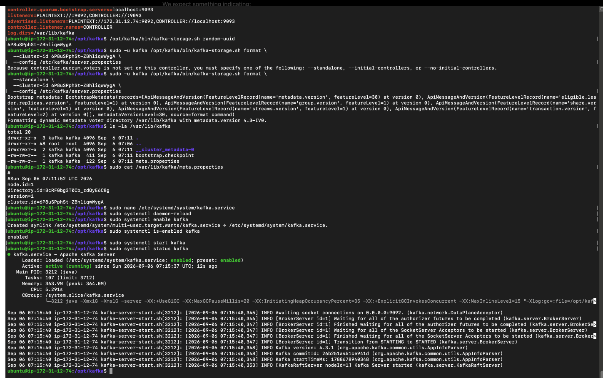
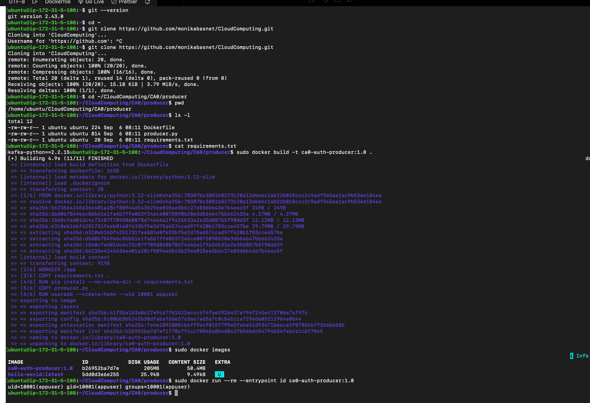
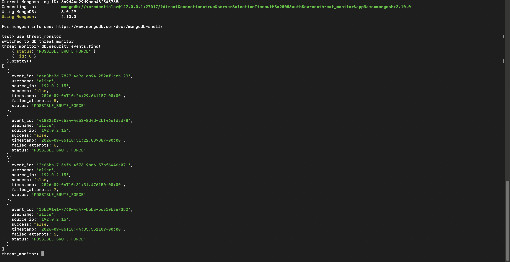
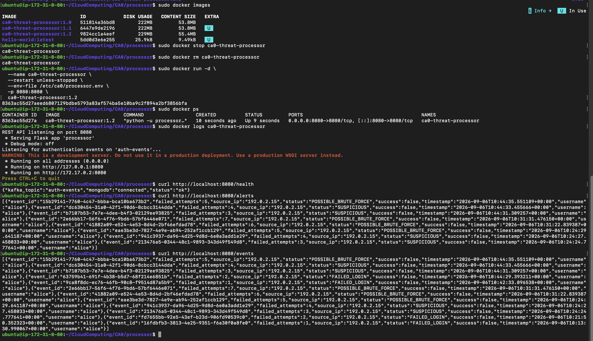

# CA0: Authentication Threat Monitoring Pipeline

## Overview

A distributed authentication threat monitoring pipeline was built on Amazon Web Services (AWS) for CA0.

The system was designed to generate synthetic authentication events, transport the events through Apache Kafka, process them using a containerized Python service, store the processed results in MongoDB, and retrieve the stored results through a REST API.

The main data pipeline is:

```text
Producer → Kafka → Processor → MongoDB
```

A REST API is also hosted by the Processor:

```text
MongoDB → REST API → Client
```

AWS Free Tier resources were used for the deployment. Four EC2 instances were provisioned so that the Producer, Kafka Broker, Processor, and Database could be separated.

The cybersecurity use case is based on repeated failed authentication attempts. Failed login events are counted by the Processor and classified as:

```text
FAILED_LOGIN
SUSPICIOUS
POSSIBLE_BRUTE_FORCE
```

The detection rule was created for demonstration purposes and is not intended to represent a production intrusion detection system.

---

## Architecture

Four EC2 instances were used.

```text
+----------------------------+
| Producer EC2               |
| 172.31.5.108               |
|                            |
| Docker                     |
| ca0-auth-producer:1.0      |
+-------------+--------------+
              |
              | JSON authentication event
              | TCP 9092
              v
+----------------------------+
| Kafka Broker EC2           |
| 172.31.12.74               |
|                            |
| Apache Kafka 4.3.1         |
| Topic: auth-events         |
+-------------+--------------+
              |
              | Kafka event
              v
+----------------------------+
| Processor EC2              |
| 172.31.8.80                |
|                            |
| Docker                     |
| ca0-threat-processor:1.2   |
| Threat Detection           |
| REST API :8080             |
+-------------+--------------+
              |
              | Authenticated MongoDB
              | TCP 27017
              v
+----------------------------+
| Database EC2               |
| 172.31.13.96               |
|                            |
| MongoDB 8.0.29             |
| Database: threat_monitor   |
+----------------------------+
```

Private IPv4 addresses were used for communication between the application components.

Public IPv4 addresses were used only for administrative SSH access.

---

## Technology Stack

The following reference stack was used.

| Layer | Technology | Version / Configuration |
|---|---|---|
| Cloud Provider | Amazon Web Services | AWS Free Tier |
| Compute | Amazon EC2 | 4 VMs |
| AWS Region | Ohio | `us-east-2` |
| Operating System | Ubuntu Server | 24.04 LTS |
| Containers | Docker Engine | Processor verified at 29.8.0 |
| Programming Language | Python | 3.12 |
| Python Base Image | Docker | `python:3.12-slim` |
| Pub/Sub | Apache Kafka | 4.3.1 |
| Kafka Runtime | OpenJDK | 17 |
| Kafka Mode | KRaft | Single node |
| Database | MongoDB Community Server | 8.0.29 |
| MongoDB Shell | Mongosh | 2.10.0 |
| REST API | Flask | 3.1.2 |
| Kafka Client | kafka-python | 2.2.15 |
| MongoDB Client | PyMongo | 4.15.0 |
| Version Control | Git and GitHub | CloudComputing repository |

Kafka was selected as the Pub/Sub component because authentication events could be transported asynchronously between the Producer and Processor.

MongoDB was selected because the authentication events could be stored naturally as document-oriented records.

Docker was used for the Producer and Processor so that reproducible application environments could be created.

---

## AWS Free Tier

The project was deployed using AWS Free Tier resources.

Cloud cost was considered during the architecture design. Four EC2 instances were used because the assignment required approximately three to four virtual machines.

A fifth VM was not created for the REST API. The API was included in the existing Processor container instead.

The following responsibilities are therefore handled by the Processor container:

```text
Kafka Consumer
Threat Classification
MongoDB Client
REST API
```

---

## EC2 Infrastructure

The following virtual machines were provisioned.

| VM | Role | Private IPv4 |
|---|---|---|
| `ca0-producer` | Authentication Event Producer | `172.31.5.108` |
| `ca0-broker` | Kafka Broker | `172.31.12.74` |
| `ca0-processor` | Threat Processor and REST API | `172.31.8.80` |
| `ca0-database` | MongoDB Database | `172.31.13.96` |

Ubuntu Server 24.04 LTS was used on the deployed instances.

Application traffic was sent through private AWS networking.

---

## Repository Structure

The project repository is organized as follows:

```text
CloudComputing/
└── CA0/
    ├── README.md
    ├── config/
    ├── diagrams/
    ├── screenshots/
    ├── producer/
    │   ├── Dockerfile
    │   ├── producer.py
    │   └── requirements.txt
    └── processor/
        ├── Dockerfile
        ├── processor.py
        └── requirements.txt
```

Database passwords and SSH private keys are not intended to be stored in the repository.

---

## Configuration Summary

| Component | Host | Image / Version | Port | Purpose |
|---|---|---|---:|---|
| Producer | `172.31.5.108` | `ca0-auth-producer:1.0` | N/A | Authentication event generation |
| Kafka | `172.31.12.74` | Kafka 4.3.1 | 9092 | Pub/Sub messaging |
| Processor | `172.31.8.80` | `ca0-threat-processor:1.2` | 8080 | Threat processing and REST API |
| MongoDB | `172.31.13.96` | MongoDB 8.0.29 | 27017 | Persistent storage |

Kafka configuration:

```text
Topic: auth-events
Partitions: 1
Replication Factor: 1
```

MongoDB configuration:

```text
Database: threat_monitor
Collection: security_events
```

---

# Producer

A Python Producer was created to generate synthetic authentication events.

An example event is:

```json
{
  "event_id": "16fdbfb3-3813-4e25-9351-f6a30f0a8fe0",
  "username": "alice",
  "source_ip": "192.0.2.15",
  "success": false,
  "timestamp": "2026-09-06T10:13:30.990067+00:00"
}
```

A unique UUID is generated for each event.

The UUID allows an event to be traced through the pipeline:

```text
Producer
   |
   | event_id
   v
Kafka
   |
   | same event_id
   v
Processor
   |
   | same event_id
   v
MongoDB
```

The Producer receives the Kafka configuration through environment variables:

```text
KAFKA_BROKER
KAFKA_TOPIC
```

---

## Producer Container

The Producer image can be built using:

```bash
cd CA0/producer

sudo docker build \
  -t ca0-auth-producer:1.0 .
```

The Producer can be executed using:

```bash
sudo docker run --rm \
  -e KAFKA_BROKER=172.31.12.74:9092 \
  -e KAFKA_TOPIC=auth-events \
  ca0-auth-producer:1.0
```

Successful output was observed in the following form:

```text
Published event: {...}
Kafka topic=auth-events, partition=0, offset=...
```

---

## Non-Root Producer

A non-root user was created inside the Producer image.

```text
User: appuser
UID: 10001
```

The runtime identity was verified using:

```bash
sudo docker run --rm \
  --entrypoint id \
  ca0-auth-producer:1.0
```

The following result was observed:

```text
uid=10001(appuser)
gid=10001(appuser)
groups=10001(appuser)
```

The Producer was therefore verified as running without root privileges inside the container.

---

# Apache Kafka

Apache Kafka 4.3.1 was installed on the Broker VM.

```text
Private IPv4: 172.31.12.74
Port: 9092
```

OpenJDK 17 was used as the Java runtime.

Kafka was configured in KRaft mode. ZooKeeper was therefore not required.

The `auth-events` topic was created using:

```bash
/opt/kafka/bin/kafka-topics.sh \
  --create \
  --topic auth-events \
  --bootstrap-server localhost:9092 \
  --partitions 1 \
  --replication-factor 1
```

The topic was verified using:

```bash
/opt/kafka/bin/kafka-topics.sh \
  --describe \
  --topic auth-events \
  --bootstrap-server localhost:9092
```

A single partition and replication factor of one were used because only one Kafka Broker was deployed.

---

## Kafka Service

Kafka was configured as a systemd service.

The following commands were used for validation:

```bash
sudo systemctl is-enabled kafka
sudo systemctl is-active kafka
```

The following results were observed:

```text
enabled
active
```

Port 9092 was also checked:

```bash
sudo ss -lntp | grep 9092
```

Kafka logs can be inspected using:

```bash
journalctl -u kafka
```

---

## Producer to Kafka Validation

Connectivity from the Producer VM to the Kafka Broker was tested independently.

```bash
nc -vz 172.31.12.74 9092
```

The following result was observed:

```text
Connection to 172.31.12.74 9092 port [tcp/*] succeeded!
```

Kafka was also tested using the Kafka console Producer and Consumer before the Docker Producer was connected.

A sample authentication event was successfully published and consumed.

---

# MongoDB

MongoDB Community Server 8.0.29 was installed on the Database VM.

```text
Private IPv4: 172.31.13.96
Port: 27017
```

Mongosh version 2.10.0 was installed.

The application database is:

```text
threat_monitor
```

The collection is:

```text
security_events
```

---

## MongoDB Service

MongoDB was configured as a systemd service.

The service was validated using:

```bash
sudo systemctl is-enabled mongod
sudo systemctl is-active mongod
```

The following results were observed:

```text
enabled
active
```

MongoDB functionality was also tested using:

```bash
mongosh --eval 'db.runCommand({ ping: 1 })'
```

The following result was returned:

```text
{ ok: 1 }
```

MongoDB logs can be inspected using:

```bash
journalctl -u mongod
```

---

## MongoDB Networking

MongoDB initially listened only on:

```text
127.0.0.1:27017
```

The configuration was changed so that communication from the Processor could be accepted through the private network.

The final configuration included:

```yaml
net:
  port: 27017
  bindIp: 127.0.0.1,172.31.13.96
```

The listening addresses were verified using:

```bash
sudo ss -lntp | grep 27017
```

The following addresses were observed:

```text
127.0.0.1:27017
172.31.13.96:27017
```

A general `0.0.0.0` MongoDB binding was avoided.

---

## Processor to MongoDB Validation

Network connectivity was tested from the Processor VM.

```bash
nc -vz 172.31.13.96 27017
```

The following result was observed:

```text
Connection to 172.31.13.96 27017 port [tcp/*] succeeded!
```

---

# MongoDB Authentication

MongoDB authorization was enabled.

```yaml
security:
  authorization: enabled
```

Two database users were created.

## Administrative User

```text
ca0_admin
```

The administrative account is used only for database administration.

## Processor User

```text
ca0_processor
```

The Processor account was assigned:

```text
readWrite
```

permission only on:

```text
threat_monitor
```

The Processor therefore does not use an administrative MongoDB account.

---

## Authentication Validation

Anonymous administrative access was tested using:

```bash
mongosh --quiet \
  --eval 'db.adminCommand({listDatabases:1})'
```

The request was rejected:

```text
Command listDatabases requires authentication
```

The Processor account was authenticated separately.

The following role was confirmed:

```text
readWrite @ threat_monitor
```

---

# Secret Management

MongoDB credentials are not intentionally stored in:

```text
processor.py
Dockerfile
requirements.txt
README.md
```

Runtime configuration is stored on the Processor VM in:

```text
/etc/ca0/processor.env
```

The file was protected using:

```bash
sudo chown root:root /etc/ca0/processor.env
sudo chmod 600 /etc/ca0/processor.env
```

The following permissions were verified:

```text
-rw------- 1 root root
```

The file is supplied to Docker using:

```text
--env-file /etc/ca0/processor.env
```

Passwords are intentionally omitted from this README.

---

# Threat Processor

The Processor consumes authentication events from Kafka.

The following processing sequence is used:

```text
Kafka message
      |
      v
JSON deserialization
      |
      v
Failed login tracking
      |
      v
Threat classification
      |
      v
MongoDB insertion
      |
      v
Kafka offset commit
```

---

## Threat Classification

Consecutive failures are tracked using:

```text
(username, source_ip)
```

The following classification rule was implemented:

| Failed Attempts | Classification |
|---:|---|
| Successful login | `NORMAL` |
| 1 | `FAILED_LOGIN` |
| 2 | `FAILED_LOGIN` |
| 3 | `SUSPICIOUS` |
| 4 | `SUSPICIOUS` |
| 5 or more | `POSSIBLE_BRUTE_FORCE` |

This threshold is used as a demonstration heuristic.

Five failed logins are not claimed to prove that a real brute-force attack has occurred.

---

## Processed Event

Additional fields are added by the Processor.

An example processed event is:

```json
{
  "event_id": "15b29141-7760-4c47-bbba-bca10ba673b2",
  "username": "alice",
  "source_ip": "192.0.2.15",
  "success": false,
  "timestamp": "2026-09-06T10:44:35.551109+00:00",
  "failed_attempts": 5,
  "status": "POSSIBLE_BRUTE_FORCE"
}
```

The processed document is stored in:

```text
threat_monitor.security_events
```

---

# Kafka Offset Handling

The first Processor implementation used:

```python
enable_auto_commit=True
```

During testing, MongoDB authentication failed after Kafka messages had already been consumed.

The Kafka consumer group was inspected, and the offsets were found to have advanced.

The implementation was changed to:

```python
enable_auto_commit=False
```

The MongoDB insertion is performed first:

```python
result = collection.insert_one(processed_event)
```

The Kafka offset is then committed:

```python
consumer.commit()
```

The final sequence is:

```text
Kafka event
    |
    v
Processor
    |
    v
MongoDB write
    |
    | successful
    v
Kafka commit
```

Exactly-once processing is not claimed.

---

# Processor Container

The final Processor image is:

```text
ca0-threat-processor:1.2
```

A non-root application user is used:

```text
User: appuser
UID: 10001
```

The runtime identity was verified as:

```text
uid=10001(appuser)
gid=10001(appuser)
groups=10001(appuser)
```

---

## Persistent Deployment

The Processor was initially executed in the foreground during testing.

The final Processor was deployed as a background container:

```bash
sudo docker run -d \
  --name ca0-threat-processor \
  --restart unless-stopped \
  --env-file /etc/ca0/processor.env \
  -p 8080:8080 \
  ca0-threat-processor:1.2
```

The container was verified using:

```bash
sudo docker ps
```

The restart policy was verified as:

```text
unless-stopped
```

Processor logs are available through:

```bash
sudo docker logs ca0-threat-processor
```

---

# End-to-End Validation

A complete authentication event was traced through the pipeline.

The following event ID was used:

```text
16fdbfb3-3813-4e25-9351-f6a30f0a8fe0
```

The event was generated by the Producer.

The event was accepted by Kafka.

The same event ID was received by the Processor.

The event was classified as:

```text
FAILED_LOGIN
failed_attempts=1
```

The same event was retrieved from MongoDB.

This validated:

```text
Producer → Kafka → Processor → MongoDB
```

---

# Brute-Force Detection Test

Five consecutive synthetic failed login events were generated for:

```text
username: alice
source_ip: 192.0.2.15
```

The following progression was observed in the Processor logs:

```text
failed_attempts=1
status=FAILED_LOGIN

failed_attempts=2
status=FAILED_LOGIN

failed_attempts=3
status=SUSPICIOUS

failed_attempts=4
status=SUSPICIOUS

failed_attempts=5
status=POSSIBLE_BRUTE_FORCE
```

The fifth event was:

```text
15b29141-7760-4c47-bbba-bca10ba673b2
```

The processed event was successfully stored in MongoDB.

---

# REST API

A REST API was added to the Processor using Flask 3.1.2.

The API runs inside:

```text
ca0-threat-processor:1.2
```

The API listens on port:

```text
8080
```

Docker publishes:

```text
Host 8080 → Container 8080
```

Three REST endpoints are available.

---

## GET /health

The health endpoint is used to verify the API and MongoDB connection.

```bash
curl http://localhost:8080/health
```

The following response was observed:

```json
{
  "kafka_topic": "auth-events",
  "mongodb": "connected",
  "status": "ok"
}
```

---

## GET /events

The events endpoint returns processed authentication events.

```bash
curl http://localhost:8080/events
```

Stored events were returned successfully.

---

## GET /alerts

The alerts endpoint returns events classified as:

```text
SUSPICIOUS
POSSIBLE_BRUTE_FORCE
```

The endpoint was tested using:

```bash
curl http://localhost:8080/alerts
```

The previously generated brute-force event was returned with:

```text
failed_attempts: 5
status: POSSIBLE_BRUTE_FORCE
```

The complete application flow was therefore validated as:

```text
Producer
   |
   v
Kafka
   |
   v
Processor
   |
   v
MongoDB
   |
   v
REST API
```

---

# Service Startup and Logs

| Component | Startup | Log Location |
|---|---|---|
| Kafka | systemd | `journalctl -u kafka` |
| MongoDB | systemd | `journalctl -u mongod` |
| Processor | Docker restart policy | `docker logs ca0-threat-processor` |
| Producer | On demand | Docker terminal output |

Kafka was enabled at boot.

MongoDB was enabled at boot.

The Processor uses:

```text
--restart unless-stopped
```

The Producer is used as an event simulator and is executed when test events are required.

---

# Problems Encountered and Changes Made

Several problems were encountered during the implementation. The problems and resulting changes were documented because they affected the final architecture.

## Kafka KRaft Initialization

The first Kafka storage-formatting command failed because an explicit controller initialization option was required.

The following options were reported:

```text
--standalone
--initial-controllers
--no-initial-controllers
```

A single-node Kafka deployment was being used, so:

```text
--standalone
```

was selected.

Kafka was then initialized successfully.

---

## MongoDB Kernel Compatibility

MongoDB 8.0.29 was installed successfully, but the MongoDB service failed to start.

The problem was investigated using:

```bash
sudo systemctl status mongod
sudo journalctl -u mongod -n 30 --no-pager
```

A compatibility issue with the running Linux kernel was reported.

The Database VM was running:

```text
7.0.0-1012-aws
```

The installed kernels were inspected, and the following compatible kernel was already present:

```text
6.17.0-1017-aws
```

The GRUB configuration was backed up and updated so that the compatible installed kernel would be used.

After reboot:

```bash
uname -r
```

returned:

```text
6.17.0-1017-aws
```

The Database VM retained the same private address:

```text
172.31.13.96
```

MongoDB was then started successfully.

---

## MongoDB User Configuration

A placeholder password was accidentally used during the initial creation of the MongoDB Processor user.

A second creation attempt showed that the user already existed.

The existing user was corrected using:

```text
db.updateUser(...)
```

The corrected credentials were then validated independently.

---

## Processor Authentication Failure

During the first Processor test, Kafka events were received successfully, but MongoDB returned:

```text
Authentication failed
```

The MongoDB application account was tested directly.

The account was found to be valid.

The runtime environment configuration was then corrected.

After the configuration was corrected, the Processor successfully stored events in MongoDB.

---

## Kafka Offset Handling

Automatic Kafka offset commits were used in the first Processor implementation.

The consumer offsets were observed advancing even when MongoDB writes had failed.

Automatic commits were therefore disabled.

Manual commits were added after successful database insertion.

---

## Processor Container Lifecycle

The Processor was initially executed using:

```text
docker run --rm
```

for interactive testing.

The container was no longer running after the terminal session ended.

The final deployment was changed to:

```text
docker run -d
```

with:

```text
--restart unless-stopped
```

---

# Integrity Packet

## Claim

A distributed authentication threat monitoring pipeline was built and validated on AWS.

The following pipeline was demonstrated:

```text
Producer
   |
   v
Kafka
   |
   v
Threat Processor
   |
   v
MongoDB
   |
   v
REST API
```

Repeated synthetic authentication failures were processed and classified.

The following progression was observed:

```text
FAILED_LOGIN
FAILED_LOGIN
SUSPICIOUS
SUSPICIOUS
POSSIBLE_BRUTE_FORCE
```

The resulting alert was persisted in MongoDB and retrieved through the REST API.

---

## Assumptions

Synthetic authentication data was used.

The values:

```text
username: alice
source_ip: 192.0.2.15
```

represent demonstration data.

The classification:

```text
5 failures → POSSIBLE_BRUTE_FORCE
```

is an educational threshold.

A real attack is not claimed to have been detected.

A single Kafka Broker was used.

Kafka replication factor 1 was used.

A single MongoDB server was used.

Production high availability is therefore not provided.

The failed-login counters are stored in Processor memory and are reset when the Processor restarts.

---

## Evidence

Evidence was collected at multiple stages.

### Producer to Kafka

```bash
nc -vz 172.31.12.74 9092
```

was successful.

### Processor to MongoDB

```bash
nc -vz 172.31.13.96 27017
```

was successful.

### Kafka

Kafka was verified as active and enabled.

The `auth-events` topic was created and described.

### Containers

Both application containers were verified with:

```text
uid=10001(appuser)
```

### MongoDB

MongoDB returned:

```text
{ ok: 1 }
```

Anonymous administrative access was rejected.

The Processor account was verified with:

```text
readWrite @ threat_monitor
```

### End-to-End Event

The event:

```text
16fdbfb3-3813-4e25-9351-f6a30f0a8fe0
```

was traced through the application pipeline.

### Threat Detection

The progression from `FAILED_LOGIN` to `POSSIBLE_BRUTE_FORCE` was observed in the Processor logs.

### REST API

The following endpoints were tested successfully:

```text
GET /health
GET /events
GET /alerts
```

---

## Validation

Validation was performed layer by layer.

The following sequence was used:

```text
EC2 instances
      ↓
Private networking
      ↓
TCP connectivity
      ↓
Service status
      ↓
Kafka publish/consume
      ↓
MongoDB authentication
      ↓
Container execution
      ↓
End-to-end event
      ↓
Threat classification
      ↓
Database persistence
      ↓
REST retrieval
```

This approach allowed failures to be isolated before additional configuration was changed.

---

## AI Assistance

ChatGPT was used as an engineering assistant during the assignment.

Assistance was used for:

- AWS deployment planning;
- Linux command explanations;
- Kafka installation and configuration;
- Docker setup;
- Producer code drafting;
- Processor code drafting;
- MongoDB configuration;
- REST API implementation;
- troubleshooting;
- interpretation of command output;
- documentation organization.

Generated instructions were not treated as evidence that the deployment worked.

Commands were executed manually in the AWS environment, and actual output was used to determine whether each step had succeeded.

Several AI-assisted recommendations were changed after testing.

### MongoDB

A standard MongoDB installation process was initially followed.

The package installation succeeded, but the service failed to start.

Service logs were inspected, and a kernel compatibility problem was discovered.

The installed kernels were then inspected. A compatible kernel was already present on the Database VM, so the boot configuration was changed instead of rebuilding the entire VM.

The final solution was selected based on the actual MongoDB logs and VM configuration.

### Kafka Offset Handling

The first Processor code used Kafka automatic commits.

After a MongoDB authentication failure, Kafka consumer offsets were inspected and were found to have advanced.

The implementation was changed so that offsets would be committed only after successful MongoDB insertion.

### Docker Lifecycle

Foreground Docker execution was initially used during testing.

When the Processor was later found not to be running, a detached deployment with a restart policy was used instead.

### AI Verification Process

The following process was used when AI assistance was received:

```text
AI suggestion
     |
     v
Recommendation reviewed
     |
     v
Command executed
     |
     v
Actual output inspected
     |
     v
Independent validation performed
     |
     v
Recommendation accepted or changed
```

The actual AWS environment was treated as the source of truth.

---

## AI Critique

AI assistance was useful for explaining unfamiliar tools and providing starting points for commands and code.

However, some recommendations depended on assumptions that did not match the actual deployment.

The MongoDB kernel issue demonstrated that successful package installation did not guarantee that a service would run correctly.

The Kafka offset issue demonstrated that code could work during normal operation while still behave incorrectly during downstream failure.

The Docker lifecycle issue demonstrated that a command appropriate for testing was not necessarily appropriate for persistent deployment.

For these reasons, generated commands and code were validated before being accepted.

The strongest evidence was obtained from:

```text
service logs
network tests
Kafka offsets
MongoDB queries
Docker status
matching event IDs
REST responses
```

---

## Ownership

The AWS deployment, testing, and validation were completed by me.

The EC2 instances were created and accessed directly. Kafka, Docker, and MongoDB were installed and configured in the deployed environment.

The Docker images were built and executed by me.

Synthetic authentication events were generated during testing.

Kafka output, Processor logs, MongoDB records, and REST responses were inspected directly.

Screenshots were captured during the validation process.

Git commits and pushes were performed through the project repository.

ChatGPT was used for explanations, code drafts, command suggestions, debugging ideas, and documentation assistance.

Final decisions were based on the results observed in the actual deployment.

---

## Open Questions and Limitations

### In-Memory State

Failed-login counters are stored in Processor memory.

The counters are reset when the Processor restarts.

### Exactly-Once Processing

Exactly-once processing is not provided.

A crash after MongoDB insertion but before the Kafka commit could result in duplicate processing.

### Kafka Availability

Only one Kafka Broker is deployed.

### MongoDB Availability

Only one MongoDB server is deployed.

### REST API Security

Application-level REST authentication has not been implemented.

### Flask Server

The Flask development server is currently used.

A production deployment would require a production WSGI server.

### TLS

End-to-end application-level TLS has not been implemented for all internal connections.

### Detection Rule

The detection logic is intentionally simple and is used only to demonstrate event processing.

---

# Screenshots

Critical screenshots are stored under:

```text
CA0/screenshots/
```

Selected evidence can be embedded below after the final screenshot filenames have been assigned.

## AWS Infrastructure

```markdown

```

## Kafka

```markdown

```

## Non-Root Container

```markdown

```

## Producer

```markdown

```

## Processor

```markdown

```

## Brute-Force Detection

```markdown

```

## MongoDB

```markdown

```

## REST API

```markdown

```

---

# Reproduction Summary

## Producer

```bash
cd CA0/producer

sudo docker build \
  -t ca0-auth-producer:1.0 .

sudo docker run --rm \
  -e KAFKA_BROKER=172.31.12.74:9092 \
  -e KAFKA_TOPIC=auth-events \
  ca0-auth-producer:1.0
```

## Processor

```bash
cd CA0/processor

sudo docker build \
  -t ca0-threat-processor:1.2 .
```

A protected `/etc/ca0/processor.env` file must be created separately.

Database credentials must not be committed to GitHub.

The Processor can then be started using:

```bash
sudo docker run -d \
  --name ca0-threat-processor \
  --restart unless-stopped \
  --env-file /etc/ca0/processor.env \
  -p 8080:8080 \
  ca0-threat-processor:1.2
```

The Processor can be checked using:

```bash
sudo docker ps
sudo docker logs ca0-threat-processor
```

The REST API can be tested using:

```bash
curl http://localhost:8080/health
curl http://localhost:8080/events
curl http://localhost:8080/alerts
```

---

# Demo Video

Demo video link:

```text
ADD FINAL VIDEO LINK HERE
```

The demonstration will show:

```text
Producer
   ↓
Kafka
   ↓
Processor
   ↓
MongoDB
```

A successful REST request will also be shown.

No passwords, SSH private keys, or environment-file contents will be displayed.

---

# Final Result

A functioning distributed authentication threat monitoring pipeline was deployed on AWS.

The final data flow is:

```text
Synthetic Authentication Event
        |
        v
Producer Container
        |
        v
Kafka
        |
        v
Processor Container
        |
        v
Threat Classification
        |
        v
MongoDB
        |
        v
REST API
```

The following detection progression was demonstrated:

```text
FAILED_LOGIN
FAILED_LOGIN
SUSPICIOUS
SUSPICIOUS
POSSIBLE_BRUTE_FORCE
```

The `POSSIBLE_BRUTE_FORCE` event was persisted in MongoDB and was successfully returned through the REST `/alerts` endpoint.
