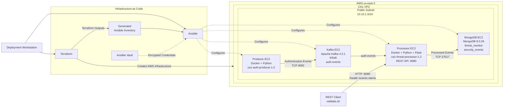

# CS5287 CA1 – Infrastructure as Code

## Overview

This project converts the CA0 authentication-event threat-monitoring system from a manually deployed environment into a reproducible **Infrastructure as Code (IaC)** deployment on AWS.

The CA1 implementation uses:

* **Terraform** for AWS infrastructure provisioning.
* **Ansible** for host configuration and application deployment.
* **Docker** for application packaging and service deployment.
* **Apache Kafka** for authentication-event streaming.
* **MongoDB** for persistent storage of processed security events.
* **Flask** for the Processor REST API.
* **Ansible Vault** for encrypted application credentials.
* **Bash automation** for deployment, inventory generation, validation, and teardown.

The application pipeline is:

```text
Authentication Event Producer
            |
            v
       Apache Kafka
        auth-events
            |
            v
      Threat Processor
            |
            v
          MongoDB
            |
            v
         REST API
```

The complete infrastructure lifecycle was also tested:

```text
Deploy
   |
   v
Validate
   |
   v
Destroy
   |
   v
Redeploy
   |
   v
Validate Again
```

This lifecycle demonstrates that the environment can be provisioned, configured, validated, destroyed, recreated, and validated again from the Infrastructure as Code configuration.

---

## Demo Video

**Demo:** https://youtu.be/Q3H7868nlro

---

# System Architecture

The deployment uses Terraform to provision AWS infrastructure and Ansible to configure the resulting EC2 instances.

Four EC2 instances are provisioned:

| Instance        | Responsibility                                               |
| --------------- | ------------------------------------------------------------ |
| `ca1-producer`  | Generates authentication events and publishes them to Kafka  |
| `ca1-kafka`     | Hosts Apache Kafka and the `auth-events` topic               |
| `ca1-processor` | Consumes, classifies, persists, and exposes processed events |
| `ca1-mongodb`   | Stores processed security events                             |

The system architecture is:



## Application Data Flow

```text
Producer
   |
   | Authentication Events
   | TCP 9092
   v
Kafka
   |
   | auth-events
   v
Processor
   |
   | Threat Classification
   |
   | 1-2 failures = FAILED_LOGIN
   | 3-4 failures = SUSPICIOUS
   | 5+ failures  = POSSIBLE_BRUTE_FORCE
   |
   | TCP 27017
   v
MongoDB
   |
   v
REST API
   |
   +-- /health
   +-- /events
   +-- /alerts
```

Private IP addresses are used for Kafka and MongoDB application communication. Public addresses are used where external SSH administration or REST API validation is required.

---

# Technology Stack

| Component                   | Technology                                |
| --------------------------- | ----------------------------------------- |
| Cloud Provider              | AWS                                       |
| Infrastructure Provisioning | Terraform                                 |
| Configuration Management    | Ansible                                   |
| Compute                     | Amazon EC2                                |
| Networking                  | AWS VPC, subnet, routing, security groups |
| Event Streaming             | Apache Kafka 4.3.1                        |
| Kafka Metadata Mode         | KRaft                                     |
| Database                    | MongoDB 8.0.29                            |
| Container Runtime           | Docker                                    |
| Producer                    | Python                                    |
| Processor                   | Python                                    |
| REST API                    | Flask                                     |
| Secret Management           | Ansible Vault                             |
| Automation                  | Bash                                      |

The following local tool versions were used during implementation and final validation:

```text
Terraform v1.16.3
Ansible Core 2.21.4
AWS CLI 2.36.49
```

The Terraform configuration requires Terraform `>= 1.6.0` and uses the HashiCorp AWS provider `~> 6.0`.

---

# Repository Structure

```text
CA1/
├── .gitignore
├── README.md
├── IntegrityPacket.md
│
├── terraform/
│   ├── .terraform.lock.hcl
│   ├── providers.tf
│   ├── variables.tf
│   ├── networking.tf
│   ├── security.tf
│   ├── compute.tf
│   ├── outputs.tf
│   └── terraform.tfvars.example
│
├── ansible/
│   ├── ansible.cfg
│   ├── site.yml
│   ├── group_vars/
│   │   └── all/
│   │       ├── vars.yml
│   │       └── vault.yml
│   └── roles/
│       ├── common/
│       ├── docker/
│       ├── kafka/
│       ├── mongodb/
│       ├── processor/
│       └── producer/
│
├── scripts/
│   ├── deploy.sh
│   ├── destroy.sh
│   ├── generate-inventory.sh
│   └── validate.sh
│
├── run-logs/
│   ├── deploy.log
│   ├── destroy.log
│   └── validation.log
│
└── evidence/
```

[View project structure evidence](evidence/02-ca1-project-structure.png)

---

# Infrastructure Provisioning

Terraform defines and manages the AWS infrastructure.

The configuration is separated by responsibility:

```text
providers.tf    -> Terraform and AWS provider configuration
variables.tf    -> configurable parameters
networking.tf   -> VPC, subnet, routing, and network resources
security.tf     -> security groups and firewall rules
compute.tf      -> EC2 instances and SSH key resource
outputs.tf      -> operational deployment outputs
```

This separation keeps the infrastructure modular and easier to understand, maintain, and reproduce.

Terraform provisions the networking, security, SSH key resource, and four application EC2 instances.

Evidence:

* [Terraform validation](evidence/04-terraform-validate.png)
* [Terraform execution plan](evidence/05-terraform-plan.png)
* [Terraform apply success](evidence/06-terraform-apply-success.png)
* [Four provisioned EC2 instances](evidence/07-four-ec2-instances.png)

---

# Parameterization and Flexibility

Deployment-specific settings are exposed through Terraform variables.

Configurable values include:

* AWS region
* project name
* EC2 instance type
* VPC CIDR
* subnet CIDR
* Kafka port
* Kafka topic
* MongoDB port
* REST API port
* Producer image/tag
* Processor image/tag
* Kafka version
* MongoDB version
* MongoDB database
* MongoDB collection
* administrator CIDR
* SSH public-key path
* AMI architecture

Defaults are defined in:

```text
terraform/variables.tf
```

Example deployment-specific overrides are provided through:

```text
terraform/terraform.tfvars.example
```

Environment-specific values can be supplied using a local `terraform.tfvars` file or normal Terraform CLI variable mechanisms.

The real `terraform.tfvars` file is excluded from Git.

[View parameterization evidence](evidence/30-terraform-parameterization.png)

---

# Network and Security Configuration

Terraform defines the VPC, subnet, routing, and security groups.

The implemented network controls include:

* SSH administration restricted through `admin_cidr`.
* Kafka access from the Producer.
* Kafka access from the Processor.
* MongoDB access from the Processor.
* REST API access through the Processor security group.
* Outbound access required for installation and service operation.

Service-to-service communication is restricted using security-group relationships where applicable instead of broadly exposing internal service ports.

Evidence:

* [Kafka security group](evidence/08-security-group-kafka.png)
* [MongoDB security group](evidence/09-security-group-mongodb.png)
* [Processor security group](evidence/10-security-group-processor.png)

---

# Secure Secret Handling

MongoDB credentials are protected using **Ansible Vault**.

The encrypted file is:

```text
ansible/group_vars/all/vault.yml
```

The Vault header was verified as:

```text
$ANSIBLE_VAULT;1.1;AES256
```

The encrypted file contains variables corresponding to:

```yaml
vault_mongodb_username: "<mongodb-username>"
vault_mongodb_password: "<mongodb-password>"
```

Non-secret shared configuration is stored separately in:

```text
ansible/group_vars/all/vars.yml
```

The Vault password is not stored in the repository.

The `.gitignore` configuration excludes sensitive or machine-specific artifacts including:

* Terraform state
* Terraform state backups
* saved Terraform plans
* real Terraform variable files
* generated Ansible inventory
* private SSH keys
* environment files
* Vault password files

AWS credentials are also not stored in the repository.

Evidence:

* [Ansible Vault encryption](evidence/11-ansible-vault-encrypted.png)
* [Secret and repository hygiene](evidence/29-secret-and-repository-hygiene.png)

---

# Ansible Configuration Management

Ansible roles are separated by responsibility:

```text
common
docker
kafka
mongodb
processor
producer
```

The `common` and `docker` roles prepare the hosts.

The remaining service-specific roles configure Kafka, MongoDB, the Processor, and the Producer.

Evidence:

* [Ansible connectivity](evidence/12-ansible-connectivity.png)
* [Base provisioning](evidence/13-ansible-base-provisioning.png)
* [Base idempotency](evidence/14-ansible-idempotency-base.png)
* [MongoDB deployment](evidence/15-mongodb-ansible-deployment.png)
* [Kafka deployment](evidence/16-kafka-ansible-deployment.png)
* [Kafka verification](evidence/17-kafka-verification.png)
* [Base configuration](evidence/18-ansible-base-configuration.png)
* [Service deployment](evidence/19-ansible-services-deployment.png)
* [Successful playbook recap](evidence/20-ansible-playbook-recap.png)
* [Processor deployment](evidence/21-processor-ansible-deployment.png)
* [Processor REST/security verification](evidence/22-processor-rest-security-verification.png)

---

# Automated Inventory Generation

Ansible inventory is generated automatically from Terraform outputs by:

```bash
./scripts/generate-inventory.sh
```

The script reads:

```text
producer_public_ip
kafka_public_ip
processor_public_ip
mongodb_public_ip
```

and generates:

```text
ansible/inventory.ini
```

The generated inventory is excluded from Git because its addresses are specific to each deployment.

No EC2 addresses need to be copied manually into the inventory.

During destroy/redeploy testing, recreated EC2 instances generated new SSH host identities. The inventory workflow was revised so stale host-key entries associated with current Terraform-generated addresses are removed before connection and new host keys can be accepted.

Following the correction, all four recreated hosts returned successful Ansible `pong` responses and the complete automated deployment succeeded.

---

# Kafka

Apache Kafka 4.3.1 is deployed in **KRaft mode**.

The topic is:

```text
auth-events
```

The broker port is:

```text
9092
```

A single combined KRaft broker/controller is used.

Because only one broker is deployed, the internal Kafka replication settings are configured for a single-node environment:

```text
offsets.topic.replication.factor=1
transaction.state.log.replication.factor=1
transaction.state.log.min.isr=1
```

These settings support consumer-group operation in the single-broker CA1 environment.

[View Kafka verification](evidence/17-kafka-verification.png)

---

# MongoDB

MongoDB 8.0.29 is deployed in Docker with authentication enabled.

The application database is:

```text
threat_monitor
```

The collection is:

```text
security_events
```

MongoDB authentication is verified automatically by Ansible after deployment.

[View MongoDB deployment](evidence/15-mongodb-ansible-deployment.png)

---

# Producer

The Dockerized Python Producer publishes JSON authentication events to Kafka.

Each event contains:

```text
event_id
username
source_ip
success
timestamp
```

Successful Kafka publication is confirmed using returned Kafka metadata:

```text
topic
partition
offset
```

[View Producer publication](evidence/23-producer-event-and-play-recap.png)

---

# Processor and REST API

The Processor is deployed as a Dockerized Python application.

It performs the following workflow:

1. Consume authentication events from Kafka.
2. Track failed authentication attempts.
3. Classify each event.
4. Add classification metadata.
5. Store processed events in MongoDB.
6. Commit Kafka offsets.
7. Expose results through the Flask REST API.

The API listens on:

```text
8080
```

The REST interface is provisioned through code and does not rely on undocumented manual configuration.

## REST Endpoints

| Endpoint  | Purpose                                            |
| --------- | -------------------------------------------------- |
| `/health` | Reports application and MongoDB health             |
| `/events` | Returns processed authentication events            |
| `/alerts` | Returns suspicious and possible brute-force events |

The current base URL can be retrieved with:

```bash
terraform -chdir=terraform output -raw rest_api_base_url
```

---

# Threat Detection

Failed authentication attempts are tracked using:

```text
username + source_ip
```

The implemented classification thresholds are:

| Failed Attempts | Classification         |
| --------------: | ---------------------- |
|             1–2 | `FAILED_LOGIN`         |
|             3–4 | `SUSPICIOUS`           |
|              5+ | `POSSIBLE_BRUTE_FORCE` |

A successful login resets the active failure counter for that username/source-IP combination.

Repeated failed authentication events were generated during validation. Escalation through `SUSPICIOUS` to `POSSIBLE_BRUTE_FORCE` was observed.

[View brute-force detection](evidence/25-brute-force-detection.png)

---

# End-to-End Pipeline Validation

The complete processing flow was verified:

```text
Producer
   |
   v
Kafka
   |
   v
Processor
   |
   v
Threat Classification
   |
   v
MongoDB
   |
   v
REST API
```

Processed REST results contained the original authentication-event fields together with Processor-generated fields including:

```text
failed_attempts
status
```

MongoDB was also queried directly to verify that classified security events had been persisted.

Evidence:

* [End-to-end event processing](evidence/24-end-to-end-event-processing.png)
* [Brute-force detection](evidence/25-brute-force-detection.png)
* [MongoDB security events](evidence/26-mongodb-security-events.png)

---

# Automated Smoke Test

An automated post-deployment smoke test is provided through:

```bash
./scripts/validate.sh
```

The validation checks the primary application path:

```text
Ansible connectivity
        |
        v
Processor /health
        |
        v
Producer event publication
        |
        v
Kafka ingestion
        |
        v
Processor consumption
        |
        v
MongoDB persistence
        |
        v
REST /events response
```

A successful validation ends with:

```text
=== CA1 pipeline validation completed successfully ===
```

The smoke test therefore verifies that the hosts are reachable, the Processor is healthy, a Producer event can enter Kafka, the Processor can consume and persist it, and the resulting data is available through the REST API.

Evidence:

* [Automated pipeline validation](evidence/28-automated-pipeline-validation.png)
* [Post-redeploy validation](evidence/34-post-redeploy-validation.png)

The `/alerts` endpoint is additionally tested as part of the threat-detection validation and can be checked manually using:

```bash
curl -s "$(terraform -chdir=terraform output -raw rest_api_base_url)/alerts" \
  | python3 -m json.tool
```

---

# Idempotency

## Ansible Idempotency

Ansible idempotency was tested by repeating configuration after the desired state had been reached.

The repeat run reported:

```text
changed=0
failed=0
```

for the configured Kafka, MongoDB, Processor, and Producer services.

[View complete Ansible idempotency evidence](evidence/27-ansible-idempotency.png)

## Terraform Consistency

Terraform consistency was also verified.

When the deployment automation was rerun against infrastructure that already matched the Terraform configuration, Terraform reported:

```text
0 added
0 changed
0 destroyed
```

This demonstrates that resources already matching the declared infrastructure state were not unnecessarily recreated.

[View automated redeployment evidence](evidence/33-automated-redeployment.png)

---

# Automated Teardown and Redeployment

The complete Terraform-managed environment can be removed using:

```bash
./scripts/destroy.sh
```

The script displays a Terraform destroy plan and requests confirmation before deletion.

During the tested lifecycle, Terraform planned:

```text
0 to add
0 to change
27 to destroy
```

The environment was successfully destroyed and Terraform state was checked afterward.

[View destroy verification](evidence/32-terraform-destroy-verification.png)

The environment was subsequently recreated through:

```bash
./scripts/deploy.sh
```

[View automated redeployment](evidence/33-automated-redeployment.png)

After recreation, a new authentication event was published at Kafka partition `0`, offset `0`, processed by the recreated Processor, and returned through the REST API.

[View post-redeploy validation](evidence/34-post-redeploy-validation.png)

The verified lifecycle was therefore:

```text
deploy -> validate -> destroy -> redeploy -> validate
```

---

# Reproducibility

The CA1 environment is designed so that another authorized user can reproduce the deployment from the repository on another workstation.

A fresh reproduction does **not** require:

* original Terraform state
* original EC2 addresses
* generated Ansible inventory from the previous deployment
* original AWS resources
* original private SSH key

The reproducing workstation supplies its own:

* AWS authentication
* administrator public IP address
* SSH key
* local `terraform.tfvars`
* Ansible Vault credentials

## 1. Clone the Repository

```bash
git clone https://github.com/monikabasnet/CloudComputing.git
cd CloudComputing
```

If the submission is being evaluated from the `ca1-iac` branch:

```bash
git checkout ca1-iac
```

Enter the project:

```bash
cd CA1
```

Terraform state from another deployment should **not** be copied into a fresh reproduction.

---

## 2. Verify Required Tools

The workstation requires:

* Terraform 1.6 or newer
* Ansible
* AWS CLI
* SSH
* Bash

Verify them with:

```bash
terraform version
ansible --version
aws --version
ssh -V
bash --version
```

---

## 3. Configure AWS Authentication

Use a non-root AWS IAM identity with sufficient permissions to create and delete the AWS resources used by the project.

Verify the active identity:

```bash
aws sts get-caller-identity
```

If a named AWS profile is used:

```bash
export AWS_PROFILE=<your-profile-name>
aws sts get-caller-identity
```

Example:

```bash
export AWS_PROFILE=ca1
aws sts get-caller-identity
```

AWS credentials must not be placed in this repository.

[View IAM Terraform policy evidence](evidence/03-iam-terraform-policy.png)

---

## 4. Create an SSH Key

The default configuration expects:

```text
~/.ssh/ca1-key
~/.ssh/ca1-key.pub
```

Create the key if required:

```bash
ssh-keygen -t ed25519 -f ~/.ssh/ca1-key
chmod 600 ~/.ssh/ca1-key
```

Verify:

```bash
ls -l ~/.ssh/ca1-key ~/.ssh/ca1-key.pub
```

The private key must remain on the workstation and must not be committed.

---

## 5. Configure Terraform Variables

Copy the provided example:

```bash
cp terraform/terraform.tfvars.example terraform/terraform.tfvars
```

Determine the deployment workstation's public IPv4 address:

```bash
curl -4 https://checkip.amazonaws.com
```

Edit:

```text
terraform/terraform.tfvars
```

and set:

```hcl
admin_cidr = "<PUBLIC_IP>/32"
```

For example:

```hcl
admin_cidr = "203.0.113.10/32"
```

The default SSH public-key location is:

```hcl
ssh_public_key_path = "~/.ssh/ca1-key.pub"
```

Change this only when using another key.

The real `terraform.tfvars` file is excluded from Git.

---

## 6. Configure Ansible Vault

MongoDB credentials are stored in:

```text
ansible/group_vars/all/vault.yml
```

An authorized user with the existing Vault password can edit the encrypted file using:

```bash
ansible-vault edit ansible/group_vars/all/vault.yml
```

The required variables are:

```yaml
vault_mongodb_username: "<mongodb-username>"
vault_mongodb_password: "<mongodb-password>"
```

A person independently reproducing the project without the original Vault password can create a new encrypted file using the same variable names:

```bash
ansible-vault create ansible/group_vars/all/vault.yml
```

For example:

```yaml
---
vault_mongodb_username: "ca1_admin"
vault_mongodb_password: "<choose-a-strong-password>"
```

The Vault password must not be committed.

---

## 7. Prepare the Automation Scripts

```bash
chmod +x scripts/*.sh
```

Optionally verify Bash syntax:

```bash
bash -n scripts/deploy.sh
bash -n scripts/destroy.sh
bash -n scripts/generate-inventory.sh
bash -n scripts/validate.sh
```

No output indicates successful Bash syntax validation.

---

## 8. Initialize and Validate Terraform

Initialize:

```bash
terraform -chdir=terraform init
```

Validate:

```bash
terraform -chdir=terraform validate
```

Expected result:

```text
Success! The configuration is valid.
```

Review the proposed infrastructure:

```bash
terraform -chdir=terraform plan
```

---

## 9. Deploy the Complete Environment

From the `CA1` directory:

```bash
./scripts/deploy.sh
```

The deployment workflow performs:

```text
Terraform initialization
        |
        v
AWS infrastructure provisioning
        |
        v
Terraform output retrieval
        |
        v
Ansible inventory generation
        |
        v
SSH host preparation
        |
        v
Ansible configuration
        |
        v
Kafka + MongoDB + Processor + Producer
```

The Ansible Vault password is requested interactively.

A successful deployment ends with:

```text
=== CA1 deployment completed successfully ===
```

The Ansible recap should report:

```text
unreachable=0
failed=0
```

for all four hosts.

---

## 10. Inspect Deployment Outputs

```bash
terraform -chdir=terraform output
```

Important outputs include:

```text
producer_public_ip
producer_private_ip

kafka_public_ip
kafka_private_ip
kafka_bootstrap_server
kafka_topic

processor_public_ip
processor_private_ip
rest_api_base_url

mongodb_public_ip
mongodb_private_ip
mongodb_connection_target
mongodb_database
mongodb_collection

vpc_id
public_subnet_id
```

Credentials are not exposed through Terraform outputs.

Addresses and AWS resource IDs are expected to differ between independent deployments.

[View Terraform outputs evidence](evidence/31-terraform-outputs-summary.png)

---

## 11. Run the Automated Smoke Test

Run:

```bash
./scripts/validate.sh
```

Enter the Ansible Vault password when requested.

The automated validation performs:

```text
Ansible connectivity
        |
        v
REST /health
        |
        v
Producer event
        |
        v
Kafka auth-events
        |
        v
Processor
        |
        v
MongoDB
        |
        v
REST /events
```

A successful run ends with:

```text
=== CA1 pipeline validation completed successfully ===
```

This is the primary automated smoke test for the deployed environment.

---

## 12. Verify the REST API

Retrieve the generated REST API base URL:

```bash
terraform -chdir=terraform output -raw rest_api_base_url
```

Check application health:

```bash
curl -s "$(terraform -chdir=terraform output -raw rest_api_base_url)/health" \
  | python3 -m json.tool
```

Retrieve processed events:

```bash
curl -s "$(terraform -chdir=terraform output -raw rest_api_base_url)/events" \
  | python3 -m json.tool
```

Retrieve threat alerts:

```bash
curl -s "$(terraform -chdir=terraform output -raw rest_api_base_url)/alerts" \
  | python3 -m json.tool
```

---

## 13. Verify Idempotency

Check Terraform consistency:

```bash
terraform -chdir=terraform plan
```

Once the environment matches the declared configuration, Terraform should report:

```text
No changes. Your infrastructure matches the configuration.
```

The deployment script can also be rerun:

```bash
./scripts/deploy.sh
```

Terraform should not recreate infrastructure already matching the configuration.

Ansible configuration should similarly converge without unnecessary changes.

---

## 14. Destroy the Environment

When testing is complete:

```bash
./scripts/destroy.sh
```

Review the Terraform destroy plan before confirming deletion.

During the validated CA1 lifecycle test, Terraform managed 27 resources.

A successful teardown ends with:

```text
Destroy complete!

=== CA1 teardown completed successfully ===
```

---

## 15. Verify Complete Teardown

Check Terraform state:

```bash
terraform -chdir=terraform state list
```

A successful complete teardown should return no managed resources.

The EC2 state can also be inspected with:

```bash
aws ec2 describe-instances \
  --region us-east-2 \
  --filters "Name=tag:Project,Values=CS5287-CA1" \
  --query 'Reservations[].Instances[].{Name:Tags[?Key==`Name`]|[0].Value,State:State.Name,InstanceId:InstanceId}' \
  --output table
```

Previously destroyed instances may temporarily remain visible as:

```text
terminated
```

They should not remain in the `running` state.

---

## Reproduction Success Criteria

A reproduction is considered successful when:

1. Terraform validation succeeds.
2. AWS infrastructure is provisioned successfully.
3. All four EC2 hosts are configured by Ansible without failed or unreachable hosts.
4. The automated smoke test completes successfully.
5. The Producer → Kafka → Processor → MongoDB → REST pipeline operates correctly.
6. The REST endpoints return expected responses.
7. Terraform reaches a consistent state.
8. The environment can be destroyed through the provided automation.
9. Terraform state contains no managed CA1 resources after complete teardown.

The following values are expected to differ between deployments:

* AWS identity/account
* AWS CLI profile
* administrator public IP
* SSH key
* EC2 instance IDs
* public and private IP addresses
* VPC/subnet IDs
* security-group IDs
* event UUIDs
* Kafka offsets
* Terraform state

---

# Run Logs

Execution logs from the final lifecycle tests are retained in:

```text
run-logs/
├── destroy.log
├── deploy.log
└── validation.log
```

The logs provide execution records for:

* infrastructure deployment
* Ansible configuration
* Terraform outputs
* Producer execution
* pipeline validation
* infrastructure teardown

The final validation log ends with:

```text
=== CA1 pipeline validation completed successfully ===
```

---

# Terraform Outputs

Terraform exposes operational information required after deployment.

Outputs include:

```text
Producer public/private IP
Kafka public/private IP
Kafka bootstrap server
Kafka topic
Processor public/private IP
REST API base URL
MongoDB public/private IP
MongoDB connection target
MongoDB database
MongoDB collection
VPC ID
Subnet ID
AMI information
```

Database credentials are intentionally not included in Terraform outputs.

[View Terraform outputs summary](evidence/31-terraform-outputs-summary.png)

---

# Validation Results Summary

| Requirement / Validation           | Result | Evidence                                |
| ---------------------------------- | ------ | --------------------------------------- |
| Terraform configuration validation | Passed | `04-terraform-validate.png`             |
| Terraform execution plan           | Passed | `05-terraform-plan.png`                 |
| Terraform AWS provisioning         | Passed | `06-terraform-apply-success.png`        |
| Four EC2 instances                 | Passed | `07-four-ec2-instances.png`             |
| Network security controls          | Passed | `08`, `09`, `10`                        |
| Parameterized Terraform            | Passed | `30-terraform-parameterization.png`     |
| Encrypted Ansible Vault            | Passed | `11-ansible-vault-encrypted.png`        |
| Repository secret hygiene          | Passed | `29-secret-and-repository-hygiene.png`  |
| Ansible connectivity               | Passed | `12-ansible-connectivity.png`           |
| MongoDB deployment/authentication  | Passed | `15-mongodb-ansible-deployment.png`     |
| Kafka deployment/KRaft             | Passed | `16`, `17`                              |
| Producer publication               | Passed | `23-producer-event-and-play-recap.png`  |
| Processor consumption              | Passed | `24-end-to-end-event-processing.png`    |
| Threat classification              | Passed | `25-brute-force-detection.png`          |
| MongoDB persistence                | Passed | `26-mongodb-security-events.png`        |
| REST `/health`                     | Passed | `28-automated-pipeline-validation.png`  |
| REST `/events`                     | Passed | `24`, `28`                              |
| REST `/alerts`                     | Passed | `25-brute-force-detection.png`          |
| Automated smoke test               | Passed | `28-automated-pipeline-validation.png`  |
| Ansible idempotency                | Passed | `27-ansible-idempotency.png`            |
| Terraform teardown                 | Passed | `32-terraform-destroy-verification.png` |
| Terraform state cleanup            | Passed | `32-terraform-destroy-verification.png` |
| Automated redeployment             | Passed | `33-automated-redeployment.png`         |
| Inventory regeneration             | Passed | `33-automated-redeployment.png`         |
| Post-redeploy validation           | Passed | `34-post-redeploy-validation.png`       |
| Run logs retained                  | Passed | `run-logs/`                             |

---

# Trade-offs and Limitations

## Four EC2 Instances

Separate EC2 instances are used for the Producer, Kafka, Processor, and MongoDB.

**Benefit:** Provides service isolation and retains the distributed CA0 architecture.

**Trade-off:** Consumes more AWS resources than a consolidated deployment.

## Single-Node Kafka

Kafka uses one combined KRaft broker/controller.

**Benefit:** Reduces resource usage and operational complexity.

**Trade-off:** Broker redundancy and high availability are not provided.

A production environment would normally use multiple Kafka nodes and replicated partitions.

## Single MongoDB Instance

MongoDB runs as one container on one EC2 instance.

**Benefit:** Reduces deployment complexity and resource consumption.

**Trade-off:** Replica-set redundancy and automatic failover are not provided.

## Public Subnet

CA1 hosts are deployed in a public subnet while service access is restricted through security groups.

**Benefit:** Simplifies SSH administration and assignment validation.

**Trade-off:** A production architecture would normally place Kafka and MongoDB in private subnets and expose only the required public interfaces.

## Docker Images Built on Target Hosts

Producer and Processor images are built on their EC2 hosts.

**Benefit:** An external container registry and registry credentials are not required.

**Trade-off:** Build time and compute resources are consumed on the target hosts.

A production workflow would normally build immutable images through CI/CD and store them in a registry such as Amazon ECR.

## Public REST API

The REST API is reachable through the Processor public address for testing.

**Benefit:** Allows direct validation from the deployment workstation.

**Trade-off:** A production API would normally use HTTPS, authentication/authorization, and an API gateway or load balancer.

## In-Memory Threat Counters

Failed-login counters are maintained in Processor memory.

**Benefit:** Keeps streaming classification simple.

**Trade-off:** Active counters reset when the Processor restarts.

Stored MongoDB events remain persistent, but active counter state is not automatically reconstructed.

## Local Terraform State

Terraform state is maintained locally.

**Benefit:** Keeps the assignment configuration simple.

**Trade-off:** Shared locking, centralized recovery, and collaborative state management are not provided.

A production environment would normally use a secured remote backend.

## Generated Inventory and SSH Host Keys

Ansible inventory is generated from Terraform outputs.

**Benefit:** EC2 addresses do not need to be manually copied.

**Trade-off:** Public addresses and SSH host identities can change following infrastructure recreation.

The lifecycle test exposed this behavior, and the inventory workflow was revised to handle stale host-key entries for recreated Terraform hosts.

## Interactive Vault Password

The Ansible Vault password is supplied interactively.

**Benefit:** The password is not stored in deployment scripts or the repository.

**Trade-off:** Deployment is not fully unattended.

A production CI/CD environment would normally integrate a dedicated secret-management system.

---

# Deviations from CA0

CA0 relied primarily on manual provisioning and configuration.

CA1 replaces those activities with code-driven automation while retaining the functional authentication-event processing architecture.

Major changes include:

* AWS infrastructure provisioned through Terraform.
* Networking declared through Terraform.
* Security groups declared through Terraform.
* EC2 instances declared through Terraform.
* Infrastructure configuration parameterized.
* Terraform outputs expose operational deployment information.
* Ansible inventory generated automatically.
* Host configuration separated into Ansible roles.
* Secrets protected with Ansible Vault.
* Producer and Processor applications containerized.
* Kafka deployment automated.
* MongoDB deployment and authentication automated.
* REST API deployment automated.
* End-to-end pipeline validation automated.
* Automated smoke testing provided.
* Infrastructure teardown automated.
* Complete destroy/redeploy lifecycle tested.
* Recreated-host SSH handling incorporated into automation.

---

# Integrity Packet

The project Integrity Packet is included at:

[View IntegrityPacket.md](IntegrityPacket.md)

It documents:

* automation claims
* supporting evidence
* assumptions
* validation results
* troubleshooting
* configuration corrections
* AI-assisted work
* review and revision of AI-assisted suggestions

---

# Evidence Index

All screenshots are stored in the `evidence/` directory.

## Terraform and AWS

* [02 – CA1 project structure](evidence/02-ca1-project-structure.png)
* [03 – IAM Terraform policy](evidence/03-iam-terraform-policy.png)
* [04 – Terraform validation](evidence/04-terraform-validate.png)
* [05 – Terraform plan](evidence/05-terraform-plan.png)
* [06 – Terraform apply success](evidence/06-terraform-apply-success.png)
* [07 – Four EC2 instances](evidence/07-four-ec2-instances.png)
* [08 – Kafka security group](evidence/08-security-group-kafka.png)
* [09 – MongoDB security group](evidence/09-security-group-mongodb.png)
* [10 – Processor security group](evidence/10-security-group-processor.png)

## Ansible, Services, and Secrets

* [11 – Ansible Vault encrypted](evidence/11-ansible-vault-encrypted.png)
* [12 – Ansible connectivity](evidence/12-ansible-connectivity.png)
* [13 – Ansible base provisioning](evidence/13-ansible-base-provisioning.png)
* [14 – Ansible base idempotency](evidence/14-ansible-idempotency-base.png)
* [15 – MongoDB Ansible deployment](evidence/15-mongodb-ansible-deployment.png)
* [16 – Kafka Ansible deployment](evidence/16-kafka-ansible-deployment.png)
* [17 – Kafka verification](evidence/17-kafka-verification.png)
* [18 – Ansible base configuration](evidence/18-ansible-base-configuration.png)
* [19 – Ansible services deployment](evidence/19-ansible-services-deployment.png)
* [20 – Ansible playbook recap](evidence/20-ansible-playbook-recap.png)
* [21 – Processor Ansible deployment](evidence/21-processor-ansible-deployment.png)
* [22 – Processor REST/security verification](evidence/22-processor-rest-security-verification.png)
* [23 – Producer event and play recap](evidence/23-producer-event-and-play-recap.png)
* [27 – Complete Ansible idempotency](evidence/27-ansible-idempotency.png)
* [29 – Secret and repository hygiene](evidence/29-secret-and-repository-hygiene.png)

## Pipeline Validation

* [24 – End-to-end event processing](evidence/24-end-to-end-event-processing.png)
* [25 – Brute-force detection](evidence/25-brute-force-detection.png)
* [26 – MongoDB security events](evidence/26-mongodb-security-events.png)
* [28 – Automated pipeline validation](evidence/28-automated-pipeline-validation.png)

## Parameterization and Outputs

* [30 – Terraform parameterization](evidence/30-terraform-parameterization.png)
* [31 – Terraform outputs summary](evidence/31-terraform-outputs-summary.png)

## Lifecycle and Reproducibility

* [32 – Terraform destroy verification](evidence/32-terraform-destroy-verification.png)
* [33 – Automated redeployment](evidence/33-automated-redeployment.png)
* [34 – Post-redeploy validation](evidence/34-post-redeploy-validation.png)

---

# Reproducibility and Integrity Notes

No plaintext application credentials, AWS credentials, or private SSH keys are intended to be committed.

Terraform state, saved Terraform plans, generated inventory, real Terraform variable files, and Vault password files are excluded from version control.

Application credentials are protected through Ansible Vault.

Infrastructure configuration is parameterized so environment-specific settings can be changed without rewriting the primary Terraform configuration.

Deployment, inventory generation, smoke testing/pipeline validation, and teardown are exposed through scripts.

The complete infrastructure lifecycle has been tested through:

```text
deployment
    |
validation
    |
teardown
    |
recreation
    |
post-redeployment validation
```

Execution records are retained in `run-logs/`, while visual evidence is retained in `evidence/`.
