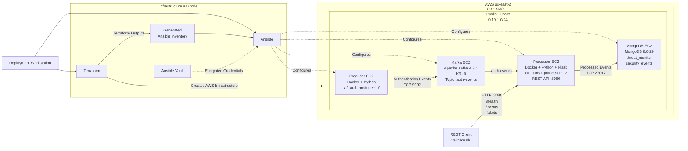

# CS5287 CA1 – Infrastructure as Code

## Overview

The CA0 authentication-event threat-monitoring system has been converted from a manually deployed environment into an automated Infrastructure as Code (IaC) deployment on AWS.

---

# Demo Video

**Demo video:** `[https://youtu.be/Q3H7868nlro]`

---

---
## System Architecture

The CA1 deployment uses Terraform for AWS infrastructure provisioning and Ansible for configuration management. The deployed application follows the Producer → Kafka → Processor → MongoDB pipeline, with the Processor also exposing the REST API.



### Application Data Flow

```text
Producer
   |
   | Authentication Events
   | TCP 9092
   v
Kafka
auth-events
   |
   v
Processor
   |
   | Threat Classification
   |
   | 1-2 failures = FAILED_LOGIN
   | 3-4 failures = SUSPICIOUS
   | 5+ failures  = POSSIBLE_BRUTE_FORCE
   |
   | TCP 27017
   v
MongoDB
   |
   v
REST API
/health
/events
/alerts
```


---

**Terraform** is used to provision AWS infrastructure, while **Ansible** is used to configure the EC2 instances and deploy the application services. Docker is used for application packaging, Apache Kafka is used for event streaming, MongoDB is used for persistent storage, and a Flask REST API is exposed by the Processor.

Supporting Bash scripts are provided for deployment, inventory generation, validation, and teardown.

The complete application pipeline is:

```text
Authentication Event Producer
            |
            v
      Apache Kafka
       auth-events
            |
            v
     Threat Processor
            |
            v
         MongoDB
            |
            v
        REST API
```

The complete infrastructure lifecycle has also been tested as:

```text
Deploy
  |
  v
Validate
  |
  v
Destroy
  |
  v
Redeploy
  |
  v
Validate Again
```

This lifecycle test demonstrated that the environment can be removed and recreated from the Infrastructure as Code configuration.

---

## Technology Stack

| Component | Technology |
|---|---|
| Cloud Provider | AWS |
| Infrastructure Provisioning | Terraform |
| Configuration Management | Ansible |
| Compute | Amazon EC2 |
| Networking | AWS VPC, subnet, routing, security groups |
| Event Streaming | Apache Kafka 4.3.1 |
| Kafka Metadata Mode | KRaft |
| Database | MongoDB 8.0.29 |
| Container Runtime | Docker |
| Producer | Python |
| Processor | Python |
| REST API | Flask |
| Secret Management | Ansible Vault |
| Automation | Bash |

The following local tool versions were used during implementation and validation:

```text
Terraform v1.16.3
Ansible Core 2.21.4
AWS CLI 2.36.49
```

The Terraform configuration requires Terraform `>= 1.6.0` and uses the HashiCorp AWS provider `~> 6.0`.

---

## Architecture

Four EC2 instances are provisioned.

| Instance | Responsibility |
|---|---|
| `ca1-producer` | Generates authentication events and publishes them to Kafka |
| `ca1-kafka` | Hosts the Kafka broker and `auth-events` topic |
| `ca1-processor` | Consumes, classifies, persists, and exposes processed events |
| `ca1-mongodb` | Stores processed security events |

The service communication flow is:

```text
ca1-producer
     |
     | Kafka TCP/9092
     v
ca1-kafka
     |
     | auth-events
     v
ca1-processor
     |
     | MongoDB TCP/27017
     v
ca1-mongodb

ca1-processor
     |
     | HTTP TCP/8080
     v
REST API Client
```

A Terraform-managed VPC and subnet are used. Service access is controlled through AWS security groups.

Private IP addresses are used for Kafka and MongoDB application communication. Public addresses are used where external SSH administration or REST API validation is required.

---

## Repository Structure

```text
CA1/
├── .gitignore
├── README.md
├── IntegrityPacket.md
│
├── terraform/
│   ├── .terraform.lock.hcl
│   ├── providers.tf
│   ├── variables.tf
│   ├── networking.tf
│   ├── security.tf
│   ├── compute.tf
│   ├── outputs.tf
│   └── terraform.tfvars.example
│
├── ansible/
│   ├── ansible.cfg
│   ├── site.yml
│   ├── group_vars/
│   │   └── all/
│   │       ├── vars.yml
│   │       └── vault.yml
│   └── roles/
│       ├── common/
│       ├── docker/
│       ├── kafka/
│       ├── mongodb/
│       ├── processor/
│       └── producer/
│
├── scripts/
│   ├── deploy.sh
│   ├── destroy.sh
│   ├── generate-inventory.sh
│   └── validate.sh
│
├── run-logs/
│   ├── deploy.log
│   ├── destroy.log
│   └── validation.log
│
└── evidence/
```

[View project structure evidence](evidence/02-ca1-project-structure.png)

---

# Reproducing the Deployment

This section describes how the environment can be reproduced on another workstation.

A new deployment does **not** require the original Terraform state, EC2 addresses, generated inventory, or original AWS resources.

The new workstation must provide its own:

- AWS authentication
- administrator public IP address
- SSH key
- local Terraform variable file
- authorized access to the Ansible Vault credentials

---

## 1. Clone the Repository

Clone the repository and enter the CA1 directory:

```bash
git clone <repository-url>
cd <repository-directory>/CA1
```

The following machine-specific or generated files are intentionally not expected to be obtained from Git:

```text
terraform/terraform.tfstate
terraform/terraform.tfstate.backup
terraform/terraform.tfvars
terraform/tfplan
ansible/inventory.ini
SSH private keys
Vault password files
```

Terraform state from a different deployment should not be copied into a fresh reproduction.

---

## 2. Install the Required Tools

The following tools are required:

- Terraform 1.6 or newer
- Ansible
- AWS CLI
- SSH client
- Bash-compatible shell

Versions can be checked with:

```bash
terraform version
ansible --version
aws --version
ssh -V
```

---

## 3. Configure AWS Authentication

A non-root AWS IAM identity with sufficient permissions should be used.

The active identity can be checked with:

```bash
aws sts get-caller-identity
```

If a named AWS CLI profile is used, it can be selected with:

```bash
export AWS_PROFILE=<profile-name>
```

For example:

```bash
export AWS_PROFILE=ca1
```

The identity should then be verified again:

```bash
aws sts get-caller-identity
```

A dedicated IAM identity was used for Terraform during the final lifecycle validation.

AWS credentials must not be stored in this repository.

[View IAM Terraform policy evidence](evidence/03-iam-terraform-policy.png)

---

## 4. Create or Identify an SSH Key

The default Terraform configuration expects the public key at:

```text
~/.ssh/ca1-key.pub
```

If a key does not already exist, one can be created with:

```bash
ssh-keygen -t ed25519 -f ~/.ssh/ca1-key
```

This produces:

```text
~/.ssh/ca1-key
~/.ssh/ca1-key.pub
```

The private key must remain on the deployment workstation and must not be committed.

A different public-key path can be supplied through the `ssh_public_key_path` Terraform variable.

---

## 5. Configure Terraform Variables

An example variable file is supplied:

```text
terraform/terraform.tfvars.example
```

Create the local configuration with:

```bash
cp terraform/terraform.tfvars.example terraform/terraform.tfvars
```

The current public IPv4 address of the deployment workstation can be obtained with:

```bash
curl -4 https://checkip.amazonaws.com
```

The `admin_cidr` value in `terraform/terraform.tfvars` should then be changed to the workstation address with a `/32` suffix.

Example:

```hcl
admin_cidr = "203.0.113.10/32"
```

Other values may also be overridden if required.

The real `terraform.tfvars` file is excluded from Git.

---

## 6. Configure Ansible Vault

MongoDB credentials are maintained in:

```text
ansible/group_vars/all/vault.yml
```

The required variables are:

```yaml
vault_mongodb_username: "<mongodb-username>"
vault_mongodb_password: "<mongodb-password>"
```

The encrypted file can be edited with:

```bash
ansible-vault edit ansible/group_vars/all/vault.yml
```

The corresponding Vault password must be supplied separately to an authorized person reproducing the deployment.

The Vault password must not be committed.

---

## 7. Prepare the Automation Scripts

Ensure that the scripts are executable:

```bash
chmod +x scripts/*.sh
```

Their Bash syntax can be checked with:

```bash
bash -n scripts/deploy.sh
bash -n scripts/destroy.sh
bash -n scripts/generate-inventory.sh
bash -n scripts/validate.sh
```

---

## 8. Initialize and Validate Terraform

Initialize Terraform:

```bash
terraform -chdir=terraform init
```

Validate the configuration:

```bash
terraform -chdir=terraform validate
```

A plan can also be reviewed before deployment:

```bash
terraform -chdir=terraform plan
```

Evidence from the original deployment:

- [Terraform validation](evidence/04-terraform-validate.png)
- [Terraform execution plan](evidence/05-terraform-plan.png)

---

## 9. Deploy the Environment

Run:

```bash
./scripts/deploy.sh
```

The deployment workflow performs:

```text
Terraform initialization
        |
        v
AWS infrastructure provisioning
        |
        v
Terraform output retrieval
        |
        v
Ansible inventory generation
        |
        v
SSH host preparation
        |
        v
Ansible configuration
        |
        v
MongoDB + Kafka + Processor + Producer
```

The Ansible Vault password is requested interactively.

No EC2 addresses need to be copied manually into the Ansible inventory.

Evidence:

- [Terraform apply success](evidence/06-terraform-apply-success.png)
- [Four provisioned EC2 instances](evidence/07-four-ec2-instances.png)
- [Automated redeployment](evidence/33-automated-redeployment.png)

---

## 10. Inspect Deployment Outputs

Run:

```bash
terraform -chdir=terraform output
```

Important outputs include:

```text
producer_public_ip
producer_private_ip

kafka_public_ip
kafka_private_ip
kafka_bootstrap_server
kafka_topic

processor_public_ip
processor_private_ip
rest_api_base_url

mongodb_public_ip
mongodb_private_ip
mongodb_connection_target
mongodb_database
mongodb_collection

vpc_id
public_subnet_id
```

Credentials are not exposed through Terraform outputs.

[View Terraform outputs evidence](evidence/31-terraform-outputs-summary.png)

Addresses and AWS resource IDs are expected to differ between independent deployments.

---

## 11. Validate the Pipeline

Run:

```bash
./scripts/validate.sh
```

The validation workflow checks:

```text
Ansible connectivity
        |
        v
Processor /health
        |
        v
Producer event publication
        |
        v
Kafka ingestion
        |
        v
Processor consumption
        |
        v
MongoDB persistence
        |
        v
REST /events response
```

Successful validation ends with:

```text
=== CA1 pipeline validation completed successfully ===
```

The REST API can also be checked manually.

Retrieve the base URL:

```bash
terraform -chdir=terraform output -raw rest_api_base_url
```

Check health:

```bash
curl "$(terraform -chdir=terraform output -raw rest_api_base_url)/health"
```

Retrieve events:

```bash
curl "$(terraform -chdir=terraform output -raw rest_api_base_url)/events"
```

Retrieve alerts:

```bash
curl "$(terraform -chdir=terraform output -raw rest_api_base_url)/alerts"
```

Evidence:

- [Automated pipeline validation](evidence/28-automated-pipeline-validation.png)
- [Post-redeploy validation](evidence/34-post-redeploy-validation.png)

---

## 12. Verify Idempotency

After successful configuration, the Ansible playbook can be run again.

The completed idempotency test reported:

```text
changed=0
failed=0
```

for the configured Kafka, MongoDB, Processor, and Producer services.

[View complete Ansible idempotency evidence](evidence/27-ansible-idempotency.png)

Terraform also reported:

```text
0 added
0 changed
0 destroyed
```

when the recreated AWS infrastructure already matched the Terraform configuration.

[View automated redeployment evidence](evidence/33-automated-redeployment.png)

---

## 13. Destroy the Environment

Run:

```bash
./scripts/destroy.sh
```

A Terraform destroy plan is displayed before confirmation.

During the tested lifecycle, Terraform planned:

```text
0 to add
0 to change
27 to destroy
```

After confirmation, the complete Terraform-managed environment was removed.

Terraform state was then checked to verify that no managed infrastructure resources remained.

[View destroy verification](evidence/32-terraform-destroy-verification.png)

---

## Reproduction Summary

A fresh reproduction follows:

```text
Clone repository
       |
       v
Install required tools
       |
       v
Configure non-root AWS identity
       |
       v
Create/identify SSH key
       |
       v
Create terraform.tfvars
       |
       v
Configure encrypted Vault credentials
       |
       v
terraform init + validate
       |
       v
./scripts/deploy.sh
       |
       v
terraform output
       |
       v
./scripts/validate.sh
       |
       v
./scripts/destroy.sh
```

The following values are expected to differ between deployments:

- AWS identity/account
- AWS CLI profile name
- administrator public IP
- SSH key
- EC2 instance IDs
- public and private EC2 addresses
- VPC and subnet IDs
- security-group IDs
- event UUIDs
- Kafka offsets
- Terraform state

Successful reproduction is determined by the declared infrastructure being created and the automated pipeline validation completing successfully.

---

# Infrastructure Provisioning

Terraform is used to define and manage the AWS infrastructure.

The configuration is separated by responsibility:

```text
providers.tf    -> Terraform and AWS provider configuration
variables.tf    -> configurable parameters
networking.tf   -> VPC, subnet, routing, and network resources
security.tf     -> security groups and firewall rules
compute.tf      -> EC2 instances and SSH key resource
outputs.tf      -> operational deployment outputs
```

This separation keeps the infrastructure configuration modular and readable.

---

# Network and Security Configuration

Terraform defines the VPC, subnet, routing, and security groups.

The network controls include:

- SSH access restricted using `admin_cidr`
- Kafka access from the Producer
- Kafka access from the Processor
- MongoDB access from the Processor
- REST API access through the Processor security group
- outbound access required for installation and service operation

Service communication is restricted using security-group relationships where applicable instead of exposing internal service ports broadly.

Evidence:

- [Kafka security group](evidence/08-security-group-kafka.png)
- [MongoDB security group](evidence/09-security-group-mongodb.png)
- [Processor security group](evidence/10-security-group-processor.png)

---

# Parameterization and Flexibility

Deployment-specific settings are exposed through Terraform variables.

Configurable values include:

- AWS region
- project name
- EC2 instance type
- VPC CIDR
- subnet CIDR
- Kafka port
- Kafka topic
- MongoDB port
- REST API port
- Producer image/tag
- Processor image/tag
- Kafka version
- MongoDB version
- MongoDB database
- MongoDB collection
- administrator CIDR
- SSH public-key path
- AMI architecture

Defaults are defined in:

```text
terraform/variables.tf
```

Example overrides are supplied through:

```text
terraform/terraform.tfvars.example
```

Environment-specific values can be supplied through a local `terraform.tfvars` file or normal Terraform CLI variable mechanisms.

[View parameterization evidence](evidence/30-terraform-parameterization.png)

---

# Secure Secret Handling

MongoDB credentials are protected using **Ansible Vault**.

The encrypted file is:

```text
ansible/group_vars/all/vault.yml
```

The Vault header was verified as:

```text
$ANSIBLE_VAULT;1.1;AES256
```

Non-secret shared configuration is stored separately in:

```text
ansible/group_vars/all/vars.yml
```

The Vault password is not stored in the repository.

The `.gitignore` configuration excludes sensitive or machine-specific artifacts including:

- Terraform state
- saved Terraform plans
- real Terraform variable files
- generated Ansible inventory
- private keys
- environment files
- Vault password files

The Git ignore behavior was explicitly checked before submission preparation.

Evidence:

- [Ansible Vault encryption](evidence/11-ansible-vault-encrypted.png)
- [Secret and repository hygiene](evidence/29-secret-and-repository-hygiene.png)

---

# Ansible Configuration Management

Ansible roles are separated by responsibility:

```text
common
docker
kafka
mongodb
processor
producer
```

The `common` and `docker` roles prepare the hosts.

Service-specific roles configure the remaining components.

Evidence:

- [Ansible connectivity](evidence/12-ansible-connectivity.png)
- [Base provisioning](evidence/13-ansible-base-provisioning.png)
- [Base idempotency](evidence/14-ansible-idempotency-base.png)
- [MongoDB deployment](evidence/15-mongodb-ansible-deployment.png)
- [Kafka deployment](evidence/16-kafka-ansible-deployment.png)
- [Kafka verification](evidence/17-kafka-verification.png)
- [Base configuration](evidence/18-ansible-base-configuration.png)
- [Service deployment](evidence/19-ansible-services-deployment.png)
- [Successful playbook recap](evidence/20-ansible-playbook-recap.png)
- [Processor deployment](evidence/21-processor-ansible-deployment.png)
- [Processor REST/security verification](evidence/22-processor-rest-security-verification.png)

---

# Automated Inventory Generation

Terraform-generated public addresses are automatically transferred into Ansible inventory by:

```bash
./scripts/generate-inventory.sh
```

The following Terraform outputs are read:

```text
producer_public_ip
kafka_public_ip
processor_public_ip
mongodb_public_ip
```

The generated file is:

```text
ansible/inventory.ini
```

The inventory is excluded from Git because it contains deployment-specific addresses.

During the destroy/redeploy test, recreated EC2 hosts produced new SSH host identities. The inventory-generation workflow was revised so that stale host-key entries associated with current Terraform-generated addresses are removed before connection and newly created host keys can be accepted.

After the correction, all four recreated hosts returned successful Ansible `pong` responses and the complete automated deployment succeeded.

---

# Kafka

Apache Kafka 4.3.1 is deployed in KRaft mode.

The topic is:

```text
auth-events
```

The broker port is:

```text
9092
```

A single combined KRaft broker/controller is used.

Because only one broker is present, internal Kafka replication settings are configured for a single-node deployment:

```text
offsets.topic.replication.factor=1
transaction.state.log.replication.factor=1
transaction.state.log.min.isr=1
```

These settings were required for correct consumer-group operation in the single-broker environment.

[View Kafka verification](evidence/17-kafka-verification.png)

---

# MongoDB

MongoDB 8.0.29 is deployed in Docker with authentication enabled.

The application database is:

```text
threat_monitor
```

The collection is:

```text
security_events
```

MongoDB authentication is verified automatically by Ansible after deployment.

[View MongoDB deployment](evidence/15-mongodb-ansible-deployment.png)

---

# Producer

The Dockerized Python Producer publishes JSON authentication events to Kafka.

Each event includes:

```text
event_id
username
source_ip
success
timestamp
```

Successful Kafka publication is confirmed through the returned:

```text
topic
partition
offset
```

[View Producer publication](evidence/23-producer-event-and-play-recap.png)

---

# Processor and REST API

The Processor is deployed as a Dockerized Python application.

The following workflow is performed:

1. Kafka events are consumed.
2. Failed authentication attempts are tracked.
3. Events are classified.
4. Classification metadata is added.
5. Processed events are stored in MongoDB.
6. Kafka offsets are committed.
7. Results are exposed through Flask REST endpoints.

The API listens on:

```text
8080
```

The REST interface is provisioned through code and does not rely on undocumented manual setup.

---

## REST Endpoints

| Endpoint | Purpose |
|---|---|
| `/health` | Reports application and MongoDB health |
| `/events` | Returns processed authentication events |
| `/alerts` | Returns suspicious and possible brute-force events |

The current base URL can be retrieved with:

```bash
terraform -chdir=terraform output -raw rest_api_base_url
```

---

# Threat Detection

Failed authentication attempts are tracked using:

```text
username + source_ip
```

Classification thresholds are:

| Failed Attempts | Classification |
|---:|---|
| 1–2 | `FAILED_LOGIN` |
| 3–4 | `SUSPICIOUS` |
| 5+ | `POSSIBLE_BRUTE_FORCE` |

A successful login resets the active failure counter for that username/source-IP combination.

Repeated failed events were generated during validation and escalation through `SUSPICIOUS` to `POSSIBLE_BRUTE_FORCE` was observed.

[View brute-force detection](evidence/25-brute-force-detection.png)

---

# End-to-End Pipeline Validation

The complete flow was verified:

```text
Producer
   |
   v
Kafka
   |
   v
Processor
   |
   v
Threat Classification
   |
   v
MongoDB
   |
   v
REST API
```

Processed REST results contained both the original event fields and Processor-generated fields:

```text
failed_attempts
status
```

[View end-to-end processing](evidence/24-end-to-end-event-processing.png)

MongoDB was also queried directly to confirm that classified security events had been persisted.

[View MongoDB security events](evidence/26-mongodb-security-events.png)

---

# Idempotency

Ansible idempotency was tested by repeating configuration after the desired state had been reached.

The completed repeat run showed:

```text
changed=0
failed=0
```

for the configured Kafka, MongoDB, Processor, and Producer services.

[View complete Ansible idempotency evidence](evidence/27-ansible-idempotency.png)

Terraform consistency was also observed after infrastructure recreation. When the automated deployment script was rerun against the newly created infrastructure, Terraform reported:

```text
0 added
0 changed
0 destroyed
```

[View automated redeployment evidence](evidence/33-automated-redeployment.png)

---

# Automated Teardown and Reproducibility

The teardown command is:

```bash
./scripts/destroy.sh
```

The script displays a destroy plan and requests confirmation before resource deletion.

The tested destroy plan contained:

```text
0 to add
0 to change
27 to destroy
```

The environment was destroyed successfully and Terraform state was checked afterward.

[View destroy verification](evidence/32-terraform-destroy-verification.png)

The environment was then recreated through the deployment automation.

[View automated redeployment](evidence/33-automated-redeployment.png)

A new event was subsequently published at Kafka partition `0`, offset `0`, processed by the recreated Processor, and returned through the REST API.

[View post-redeploy validation](evidence/34-post-redeploy-validation.png)

The verified lifecycle was therefore:

```text
deploy -> validate -> destroy -> redeploy -> validate
```

---

# Run Logs

Text-based execution logs from the final lifecycle tests are included in:

```text
run-logs/
├── destroy.log
├── deploy.log
└── validation.log
```

These logs provide execution records for:

- infrastructure teardown
- infrastructure deployment
- Ansible configuration
- Terraform outputs
- Producer execution
- pipeline validation

The final validation log ends with:

```text
=== CA1 pipeline validation completed successfully ===
```

---

# Outputs Summary

Terraform outputs expose the operational information required after deployment.

The outputs include:

```text
Producer public/private IP
Kafka public/private IP
Kafka bootstrap server
Kafka topic
Processor public/private IP
REST API base URL
MongoDB public/private IP
MongoDB connection target
MongoDB database
MongoDB collection
VPC ID
Subnet ID
AMI information
```

Database credentials are not included in the outputs.

[View Terraform outputs summary](evidence/31-terraform-outputs-summary.png)

Runtime addresses may change after infrastructure recreation.

---

# Validation Results Summary

| Requirement / Validation | Result |
|---|---|
| Terraform configuration validation | Passed |
| Terraform plan | Passed |
| Terraform AWS provisioning | Passed |
| VPC/subnet provisioning | Passed |
| Security-group provisioning | Passed |
| Four EC2 instances | Passed |
| Parameterized Terraform configuration | Passed |
| Encrypted Ansible Vault | Passed |
| Repository secret-hygiene checks | Passed |
| Ansible connectivity | Passed |
| Docker configuration | Passed |
| MongoDB deployment | Passed |
| MongoDB authentication | Passed |
| Kafka deployment | Passed |
| Kafka KRaft operation | Passed |
| Kafka topic operation | Passed |
| Kafka consumer-group operation | Passed |
| Producer event publication | Passed |
| Processor consumption | Passed |
| Threat classification | Passed |
| MongoDB persistence | Passed |
| REST `/health` | Passed |
| REST `/events` | Passed |
| REST `/alerts` | Passed |
| Automated smoke test | Passed |
| Ansible idempotency | Passed |
| Terraform teardown | Passed |
| Terraform state cleanup | Passed |
| Automated redeployment | Passed |
| Inventory regeneration after recreation | Passed |
| Post-redeploy validation | Passed |
| Run logs captured | Passed |

---

# Trade-offs and Limitations

## Four EC2 Instances

Separate EC2 instances are used for the Producer, Kafka, Processor, and MongoDB.

**Benefit:** Service isolation is provided and the distributed CA0 architecture is retained.

**Trade-off:** More AWS resources are consumed than in a consolidated deployment.

---

## Single-Node Kafka

Kafka is deployed as a single combined KRaft broker/controller.

**Benefit:** Resource usage and operational complexity are reduced.

**Trade-off:** Broker redundancy and high availability are not provided.

A production deployment would normally use multiple Kafka nodes and replicated partitions.

---

## Single MongoDB Instance

MongoDB is deployed as one container on one EC2 instance.

**Benefit:** Deployment complexity and resource usage are reduced.

**Trade-off:** Replica-set redundancy and automatic failover are not provided.

---

## Public Subnet

The CA1 hosts are deployed in a public subnet while service access is restricted through security groups.

**Benefit:** SSH administration and assignment validation remain straightforward.

**Trade-off:** A production architecture would normally place Kafka and MongoDB in private subnets and expose only the required public interface.

---

## Docker Images Built on Target Hosts

Producer and Processor images are built on their EC2 hosts.

**Benefit:** An external container registry and registry credentials are not required.

**Trade-off:** Build time and compute resources are consumed on the target instances.

A production workflow would normally build immutable images through CI/CD and store them in a registry such as Amazon ECR.

---

## Public REST API

The REST API is reachable through the Processor public address for testing.

**Benefit:** Direct validation from the deployment workstation is possible.

**Trade-off:** A production API would normally use HTTPS, authentication/authorization, and an API gateway or load balancer.

---

## In-Memory Threat Counters

Failed-login counters are maintained in Processor memory.

**Benefit:** Streaming classification remains simple.

**Trade-off:** Active counters are reset when the Processor is restarted.

Stored MongoDB events remain persistent, but the active counter state is not automatically reconstructed.

---

## Local Terraform State

Terraform state is maintained locally.

**Benefit:** Configuration remains simple for the assignment.

**Trade-off:** Shared state locking, centralized recovery, and collaborative access are not provided.

A production environment would normally use a secured remote backend.

---

## Generated Inventory and SSH Host Keys

Ansible inventory is generated from Terraform outputs.

**Benefit:** EC2 addresses do not need to be copied manually.

**Trade-off:** Public addresses and SSH host identities can change after infrastructure recreation.

The lifecycle test exposed this issue, and the inventory-generation workflow was revised to handle stale host-key entries for recreated Terraform hosts.

---

## Interactive Vault Password

The Ansible Vault password is supplied interactively.

**Benefit:** The password is not stored in scripts or the repository.

**Trade-off:** Fully unattended deployment is not provided.

A production CI/CD system would normally integrate a dedicated secret-management mechanism.

---

# Deviations from CA0

CA0 relied primarily on manual provisioning and configuration.

For CA1, those activities have been replaced with code-driven automation.

The following changes were introduced:

- AWS infrastructure is provisioned through Terraform.
- Networking is declared in Terraform.
- Security groups are declared in Terraform.
- EC2 instances are declared in Terraform.
- Infrastructure configuration is parameterized.
- Terraform outputs expose deployment information.
- Ansible inventory is generated automatically.
- Configuration is separated into Ansible roles.
- Secrets are protected using Ansible Vault.
- Producer and Processor applications are containerized.
- Kafka deployment is automated.
- MongoDB deployment and authentication are automated.
- REST API deployment is automated.
- Pipeline validation is automated.
- Teardown is automated.
- A complete destroy/redeploy lifecycle has been tested.
- Recreated-host SSH handling has been incorporated into the automation.

The functional CA0 event-processing architecture has been retained while the deployment mechanism has been converted to Infrastructure as Code.

---

# Integrity Packet

The Integrity Packet is included at:

[View IntegrityPacket.md](IntegrityPacket.md)

It documents:

- automation claims
- evidence supporting the claims
- assumptions
- validation results
- troubleshooting
- configuration corrections
- AI-assisted work
- review and revision of AI-assisted suggestions

---

# Evidence Index

All screenshots are stored in the `evidence/` directory.

## Terraform and AWS

- [02 – CA1 project structure](evidence/02-ca1-project-structure.png)
- [03 – IAM Terraform policy](evidence/03-iam-terraform-policy.png)
- [04 – Terraform validation](evidence/04-terraform-validate.png)
- [05 – Terraform plan](evidence/05-terraform-plan.png)
- [06 – Terraform apply success](evidence/06-terraform-apply-success.png)
- [07 – Four EC2 instances](evidence/07-four-ec2-instances.png)
- [08 – Kafka security group](evidence/08-security-group-kafka.png)
- [09 – MongoDB security group](evidence/09-security-group-mongodb.png)
- [10 – Processor security group](evidence/10-security-group-processor.png)

## Ansible, Services, and Secrets

- [11 – Ansible Vault encrypted](evidence/11-ansible-vault-encrypted.png)
- [12 – Ansible connectivity](evidence/12-ansible-connectivity.png)
- [13 – Ansible base provisioning](evidence/13-ansible-base-provisioning.png)
- [14 – Ansible base idempotency](evidence/14-ansible-idempotency-base.png)
- [15 – MongoDB Ansible deployment](evidence/15-mongodb-ansible-deployment.png)
- [16 – Kafka Ansible deployment](evidence/16-kafka-ansible-deployment.png)
- [17 – Kafka verification](evidence/17-kafka-verification.png)
- [18 – Ansible base configuration](evidence/18-ansible-base-configuration.png)
- [19 – Ansible services deployment](evidence/19-ansible-services-deployment.png)
- [20 – Ansible playbook recap](evidence/20-ansible-playbook-recap.png)
- [21 – Processor Ansible deployment](evidence/21-processor-ansible-deployment.png)
- [22 – Processor REST/security verification](evidence/22-processor-rest-security-verification.png)
- [23 – Producer event and play recap](evidence/23-producer-event-and-play-recap.png)
- [27 – Complete Ansible idempotency](evidence/27-ansible-idempotency.png)
- [29 – Secret and repository hygiene](evidence/29-secret-and-repository-hygiene.png)

## Pipeline Validation

- [24 – End-to-end event processing](evidence/24-end-to-end-event-processing.png)
- [25 – Brute-force detection](evidence/25-brute-force-detection.png)
- [26 – MongoDB security events](evidence/26-mongodb-security-events.png)
- [28 – Automated pipeline validation](evidence/28-automated-pipeline-validation.png)

## Parameterization and Outputs

- [30 – Terraform parameterization](evidence/30-terraform-parameterization.png)
- [31 – Terraform outputs summary](evidence/31-terraform-outputs-summary.png)

## Lifecycle and Reproducibility

- [32 – Terraform destroy verification](evidence/32-terraform-destroy-verification.png)
- [33 – Automated redeployment](evidence/33-automated-redeployment.png)
- [34 – Post-redeploy validation](evidence/34-post-redeploy-validation.png)

---

---

# Quick Reproduction Guide

The following sequence can be used to reproduce the CA1 environment on another machine.

The deployment creates a new AWS environment; the original Terraform state, generated inventory, EC2 addresses, and private SSH key are not required.

## 1. Clone the Repository

```bash
git clone https://github.com/monikabasnet/CloudComputing.git
cd CloudComputing
```

If CA1 is being submitted on the `ca1-iac` branch:

```bash
git checkout ca1-iac
```

Enter the project:

```bash
cd CA1
```

---

## 2. Verify Required Tools

The machine must have Terraform, Ansible, AWS CLI, SSH, and Bash available.

```bash
terraform version
ansible --version
aws --version
ssh -V
bash --version
```

Terraform 1.6 or newer is required by this project.

---

## 3. Configure AWS Authentication

AWS CLI must be authenticated using an IAM identity with permission to create and delete the AWS resources used by this project.

Verify the current identity:

```bash
aws sts get-caller-identity
```

If a named AWS profile is being used:

```bash
export AWS_PROFILE=<your-profile-name>
aws sts get-caller-identity
```

For example:

```bash
export AWS_PROFILE=ca1
aws sts get-caller-identity
```

Do not place AWS credentials in this repository.

---

## 4. Create an SSH Key

The default configuration expects:

```text
~/.ssh/ca1-key
~/.ssh/ca1-key.pub
```

Create the key if it does not already exist:

```bash
ssh-keygen -t ed25519 -f ~/.ssh/ca1-key
```

Protect the private key:

```bash
chmod 600 ~/.ssh/ca1-key
```

Verify both files:

```bash
ls -l ~/.ssh/ca1-key ~/.ssh/ca1-key.pub
```

The private key must never be committed to Git.

---

## 5. Create the Local Terraform Variables

Copy the supplied example:

```bash
cp terraform/terraform.tfvars.example terraform/terraform.tfvars
```

Find the public IPv4 address of the deployment workstation:

```bash
curl -4 https://checkip.amazonaws.com
```

Open:

```text
terraform/terraform.tfvars
```

and replace the example `admin_cidr` with the returned address followed by `/32`.

For example:

```hcl
admin_cidr = "203.0.113.10/32"
```

The default SSH public-key location is:

```hcl
ssh_public_key_path = "~/.ssh/ca1-key.pub"
```

Change it only if a different SSH key is being used.

The real `terraform.tfvars` file is excluded from Git.

---

## 6. Configure MongoDB Secrets

MongoDB credentials are stored in the encrypted Ansible Vault file:

```text
ansible/group_vars/all/vault.yml
```

An authorized user who has the Vault password can inspect or edit it with:

```bash
ansible-vault edit ansible/group_vars/all/vault.yml
```

The encrypted file requires the following variables:

```yaml
vault_mongodb_username: "<mongodb-username>"
vault_mongodb_password: "<mongodb-password>"
```

If reproducing the project independently without access to the original Vault password, create a new encrypted Vault file with the same variable names and choose new MongoDB credentials.

For example:

```bash
ansible-vault create ansible/group_vars/all/vault.yml
```

Enter:

```yaml
---
vault_mongodb_username: "ca1_admin"
vault_mongodb_password: "<choose-a-strong-password>"
```

Save and close the editor.

Remember the Vault password because Ansible will request it during deployment and validation.

Do not store the Vault password in the repository.

---

## 7. Prepare the Scripts

Make the automation scripts executable:

```bash
chmod +x scripts/*.sh
```

Check their Bash syntax:

```bash
bash -n scripts/deploy.sh
bash -n scripts/destroy.sh
bash -n scripts/generate-inventory.sh
bash -n scripts/validate.sh
```

No output indicates successful Bash syntax validation.

---

## 8. Initialize Terraform

Initialize the Terraform working directory:

```bash
terraform -chdir=terraform init
```

Validate the configuration:

```bash
terraform -chdir=terraform validate
```

Expected result:

```text
Success! The configuration is valid.
```

Review the proposed infrastructure before deployment:

```bash
terraform -chdir=terraform plan
```

---

## 9. Deploy the Complete Environment

From the `CA1` directory run:

```bash
./scripts/deploy.sh
```

Provide confirmation if Terraform requests approval.

When prompted:

```text
Vault password:
```

enter the Ansible Vault password.

The script performs:

```text
Terraform initialization
        |
        v
AWS infrastructure provisioning
        |
        v
Terraform output retrieval
        |
        v
Ansible inventory generation
        |
        v
Ansible host configuration
        |
        v
Kafka + MongoDB + Processor + Producer
```

A successful deployment ends with:

```text
=== CA1 deployment completed successfully ===
```

The Ansible recap should report:

```text
unreachable=0
failed=0
```

for all four hosts.

---

## 10. Display the New Environment

Display all Terraform outputs:

```bash
terraform -chdir=terraform output
```

The deployment provides values including:

```text
producer_public_ip
producer_private_ip

kafka_public_ip
kafka_private_ip
kafka_bootstrap_server
kafka_topic

processor_public_ip
processor_private_ip
rest_api_base_url

mongodb_public_ip
mongodb_private_ip
mongodb_connection_target
mongodb_database
mongodb_collection
```

These addresses are generated for the new deployment and are expected to differ from the addresses shown in the original CA1 screenshots.

---

## 11. Validate the Complete Pipeline

Run the automated smoke test:

```bash
./scripts/validate.sh
```

Enter the Ansible Vault password when requested.

The validation performs:

```text
Ansible connectivity
        |
        v
REST health check
        |
        v
Producer event
        |
        v
Kafka auth-events
        |
        v
Processor
        |
        v
MongoDB
        |
        v
REST /events
```

A successful run ends with:

```text
=== CA1 pipeline validation completed successfully ===
```

---

## 12. Verify the REST API Manually

Retrieve the generated REST API URL:

```bash
terraform -chdir=terraform output -raw rest_api_base_url
```

Check application health:

```bash
curl -s "$(terraform -chdir=terraform output -raw rest_api_base_url)/health" \
  | python3 -m json.tool
```

Retrieve processed events:

```bash
curl -s "$(terraform -chdir=terraform output -raw rest_api_base_url)/events" \
  | python3 -m json.tool
```

Retrieve threat alerts:

```bash
curl -s "$(terraform -chdir=terraform output -raw rest_api_base_url)/alerts" \
  | python3 -m json.tool
```

---

## 13. Verify Terraform Idempotency

Run:

```bash
terraform -chdir=terraform plan
```

After the infrastructure has reached the declared state, Terraform should report:

```text
No changes. Your infrastructure matches the configuration.
```

The deployment script can also be executed again:

```bash
./scripts/deploy.sh
```

Terraform should not recreate infrastructure that already matches the configuration.

---

## 14. Destroy the Environment

When testing is complete, remove the CA1 infrastructure:

```bash
./scripts/destroy.sh
```

Review the Terraform destroy plan before confirming the operation.

During the validated CA1 lifecycle test, Terraform managed 27 resources.

Allow the script to finish without interruption.

A successful teardown ends with:

```text
Destroy complete!

=== CA1 teardown completed successfully ===
```

---

## 15. Verify Complete Teardown

Check Terraform state:

```bash
echo "Terraform-managed CA1 resources remaining:"
terraform -chdir=terraform state list
```

A successful complete teardown should return no managed resources.

The AWS EC2 state can also be inspected with:

```bash
aws ec2 describe-instances \
  --region us-east-2 \
  --filters "Name=tag:Project,Values=CS5287-CA1" \
  --query 'Reservations[].Instances[].{Name:Tags[?Key==`Name`]|[0].Value,State:State.Name,InstanceId:InstanceId}' \
  --output table
```

Previously destroyed EC2 instances may remain visible temporarily with:

```text
terminated
```

They should not remain in the `running` state.

---

## Complete Command Sequence

For reference, the normal reproduction workflow is:

```bash
# Clone
git clone https://github.com/monikabasnet/CloudComputing.git
cd CloudComputing
git checkout ca1-iac
cd CA1

# Verify tools
terraform version
ansible --version
aws --version

# Select AWS credentials if a named profile is used
export AWS_PROFILE=<your-profile-name>
aws sts get-caller-identity

# Create SSH key if required
ssh-keygen -t ed25519 -f ~/.ssh/ca1-key
chmod 600 ~/.ssh/ca1-key

# Create local Terraform configuration
cp terraform/terraform.tfvars.example terraform/terraform.tfvars

# Determine the administrator public IP
curl -4 https://checkip.amazonaws.com

# Edit terraform/terraform.tfvars and set admin_cidr=<PUBLIC_IP>/32

# Configure the encrypted Vault if required
ansible-vault edit ansible/group_vars/all/vault.yml

# Prepare scripts
chmod +x scripts/*.sh

# Initialize and validate
terraform -chdir=terraform init
terraform -chdir=terraform validate
terraform -chdir=terraform plan

# Deploy
./scripts/deploy.sh

# Inspect
terraform -chdir=terraform output

# Validate
./scripts/validate.sh

# Test the REST API
curl -s "$(terraform -chdir=terraform output -raw rest_api_base_url)/health" \
  | python3 -m json.tool

curl -s "$(terraform -chdir=terraform output -raw rest_api_base_url)/events" \
  | python3 -m json.tool

curl -s "$(terraform -chdir=terraform output -raw rest_api_base_url)/alerts" \
  | python3 -m json.tool

# Check Terraform consistency
terraform -chdir=terraform plan

# Destroy
./scripts/destroy.sh

# Verify teardown
terraform -chdir=terraform state list
```

## Expected Successful Lifecycle

```text
Clone
  |
  v
Configure local AWS + SSH + Vault settings
  |
  v
Terraform validate
  |
  v
./scripts/deploy.sh
  |
  v
AWS infrastructure created
  |
  v
Ansible configuration completed
  |
  v
./scripts/validate.sh
  |
  v
Producer -> Kafka -> Processor -> MongoDB -> REST
  |
  v
Pipeline validation successful
  |
  v
./scripts/destroy.sh
  |
  v
Terraform-managed resources destroyed
  |
  v
Empty Terraform state
```

A reproduction is considered successful when the infrastructure deploys without failed or unreachable Ansible hosts, the automated pipeline validation completes successfully, and the final teardown removes the Terraform-managed environment.


# Reproducibility and Integrity Notes

No plaintext application credentials, AWS credentials, or private SSH keys are intended to be committed.

Terraform state, saved Terraform plans, generated inventory, real Terraform variable files, and Vault password files are excluded from version control.

Application credentials are protected through Ansible Vault.

Infrastructure configuration is parameterized so that environment-specific settings can be changed without rewriting the primary Terraform configuration.

Deployment, inventory generation, pipeline validation, and teardown are exposed through scripts.

The complete infrastructure lifecycle has been tested through deployment, validation, teardown, recreation, and post-redeployment validation.

Execution records are retained in `run-logs/`, while visual evidence is retained in `evidence/`.
