# CA2 — Kubernetes PaaS Orchestration on Amazon EKS

## CS5287 Cloud Computing

CA2 migrates the authentication-event processing pipeline developed in CA0/CA1 to a Kubernetes-based PaaS architecture running on **Amazon Elastic Kubernetes Service (EKS)**.

The logical application pipeline remains:

**Producer → Kafka → Processor → MongoDB**

The Processor also exposes a REST API for application health and event access.

This project demonstrates:

- Amazon EKS
- Kubernetes Deployments and StatefulSets
- Docker and Amazon ECR
- AWS EBS persistent storage
- Kubernetes ConfigMaps and Secrets
- NetworkPolicy isolation
- Least-privilege RBAC
- Metrics Server
- Horizontal Pod Autoscaling
- Horizontal scaling and throughput measurement
- Automated deployment and destruction
- End-to-end pipeline validation
- Reproducible application deployment

---

# 1. System Architecture

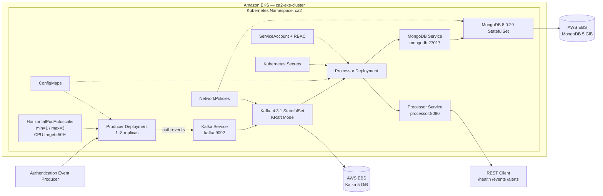

## Event Flow

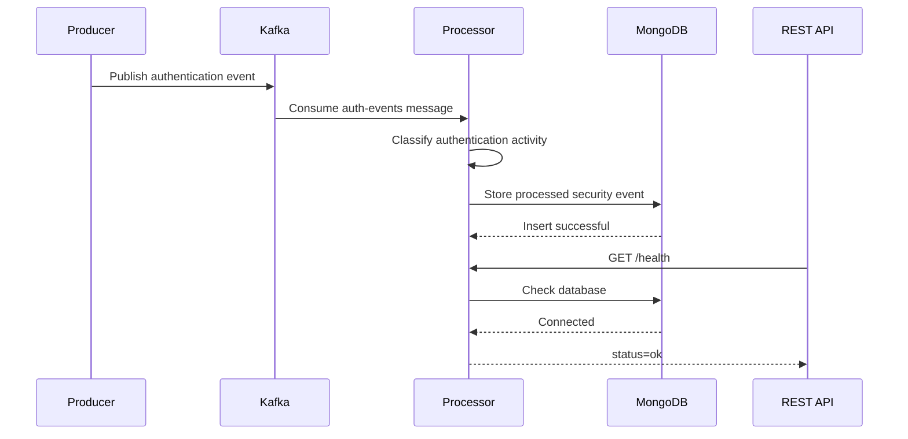

---

# 2. Project Structure

```text
CA2/
├── README.md
├── IntegrityPacket.md
├── Makefile
│
├── base/
│   └── namespace.yaml
│
├── eks/
│   └── cluster.yaml
│
├── kafka/
│   ├── service.yaml
│   └── statefulset.yaml
│
├── mongodb/
│   ├── service.yaml
│   ├── statefulset.yaml
│   └── storageclass.yaml
│
├── processor/
│   ├── Dockerfile
│   ├── configmap.yaml
│   ├── deployment.yaml
│   ├── processor.py
│   ├── requirements.txt
│   └── service.yaml
│
├── producer/
│   ├── Dockerfile
│   ├── configmap.yaml
│   ├── deployment.yaml
│   ├── producer.py
│   └── requirements.txt
│
├── network/
│   └── network-policy.yaml
│
├── rbac/
│   └── processor-rbac.yaml
│
├── scaling/
│   └── producer-hpa.yaml
│
├── scripts/
│   ├── create-secrets.sh
│   └── setup-cluster.sh
│
└── evidence/
    ├── 01-ca2-eks-iam-permissions.png
    ├── 02-eks-three-nodes.png
    ├── 03-mongodb-statefulset-pvc.png
    ├── 04-kafka-mongodb-statefulsets-pvcs.png
    ├── 05-processor-rest-health.png
    ├── 06-end-to-end-pipeline.png
    ├── 07-network-policy-enforcement.png
    ├── 08-rbac-least-privilege.png
    ├── 09-producer-scaling-throughput.png
    ├── 10-hpa-autoscaling.png
    ├── 11-full-kubernetes-stack.png
    ├── 12-kafka-persistent-storage.png
    ├── 13-brute-force-processing.png
    ├── 14-automated-redeployment.png
    └── 15-post-redeploy-pipeline-validation.png
```

---

# 3. Kubernetes Platform

The application runs on an Amazon EKS cluster.

| Setting | Value |
|---|---|
| Cluster | `ca2-eks-cluster` |
| AWS Region | `us-east-2` |
| Worker nodes | 3 |
| Node group | `ca2-workers` |
| Instance type | `t3.small` |
| Kubernetes namespace | `ca2` |

The cluster is defined in:

[`eks/cluster.yaml`](eks/cluster.yaml)

Create the cluster with:

```bash
make -C CA2 cluster-up
```

The cluster platform setup is automated through:

```bash
make -C CA2 cluster-setup
```

This configures required EKS platform components such as the Pod Identity Agent, EBS CSI add-on, and VPC CNI NetworkPolicy support.

---

# 4. EKS Cluster Evidence

Three EKS worker nodes were successfully created and reached the `Ready` state.

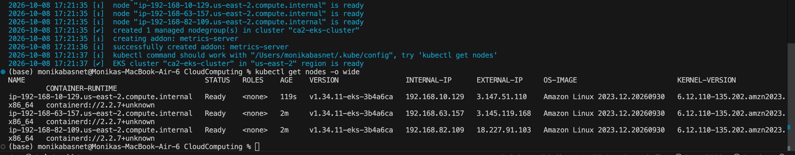

This was verified using:

```bash
kubectl get nodes -o wide
```

---

# 5. Container Images and Amazon ECR

The Producer and Processor are packaged as Docker images.

The development machine uses Apple Silicon while the EKS worker nodes use AMD64, so the application images were explicitly built for:

```text
linux/amd64
```

Example:

```bash
docker buildx build \
  --platform linux/amd64 \
  -t ca2-producer:v2 \
  --load \
  CA2/producer
```

Private Amazon ECR repositories are used for:

```text
ca2-producer
ca2-processor
```

No AWS account-specific registry identifiers or credentials are stored in this README.

---

# 6. Producer

The Producer generates authentication events continuously.

Each event contains:

```text
event_id
username
source_ip
success
timestamp
```

The Producer publishes events to:

```text
Kafka broker: kafka:9092
Kafka topic:  auth-events
```

Configuration is stored in:

[`producer/configmap.yaml`](producer/configmap.yaml)

The Producer runs as a Kubernetes Deployment:

[`producer/deployment.yaml`](producer/deployment.yaml)

This allows the Producer to be horizontally scaled.

---

# 7. Kafka

Apache Kafka **4.3.1** runs as a Kubernetes StatefulSet in **KRaft mode**.

ZooKeeper is not required.

Kafka configuration:

| Setting | Value |
|---|---|
| Client port | `9092` |
| Controller port | `9093` |
| Topic | `auth-events` |
| Kubernetes Service | `kafka` |
| Replicas | 1 |
| Storage | 5 GiB EBS |

Kafka is defined in:

- [`kafka/statefulset.yaml`](kafka/statefulset.yaml)
- [`kafka/service.yaml`](kafka/service.yaml)

---

# 8. Kafka Persistent Storage

Kafka uses an AWS EBS-backed PersistentVolumeClaim.

Kafka stores its actual data under:

```text
/var/lib/kafka/data/kafka
```

A dedicated `kafka` subdirectory is used instead of the filesystem root so that the EBS `lost+found` directory is not interpreted as Kafka topic data.

The volume was inspected from inside the Kafka Pod and contained Kafka metadata and consumer-offset directories.

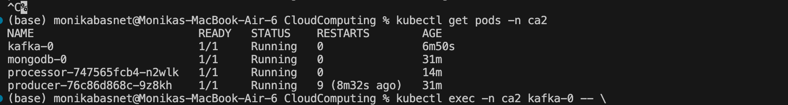

This demonstrates that Kafka is actively writing data to persistent EBS storage rather than temporary container storage.

---

# 9. MongoDB

MongoDB **8.0.29** runs as a Kubernetes StatefulSet.

| Setting | Value |
|---|---|
| Service | `mongodb` |
| Port | `27017` |
| Database | `threat_monitor` |
| Collection | `security_events` |
| Storage | 5 GiB EBS |

MongoDB configuration:

- [`mongodb/statefulset.yaml`](mongodb/statefulset.yaml)
- [`mongodb/service.yaml`](mongodb/service.yaml)
- [`mongodb/storageclass.yaml`](mongodb/storageclass.yaml)

MongoDB stores its database files under:

```text
/data/db
```

---

# 10. Persistent Storage Evidence

MongoDB was successfully deployed with a Bound PersistentVolumeClaim.

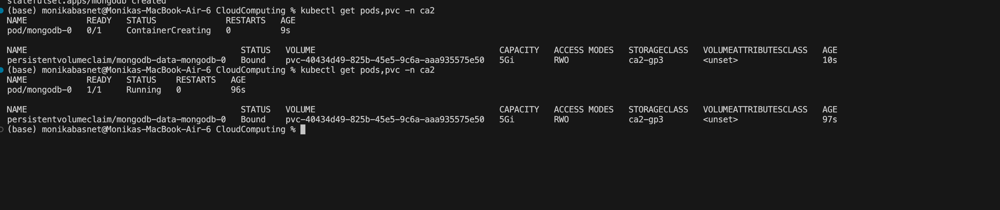

Kafka and MongoDB were then verified together with both PVCs in the `Bound` state.

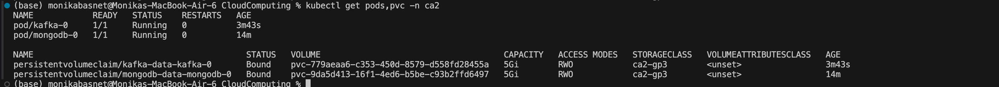

---

# 11. AWS EBS CSI Driver

Persistent storage is dynamically provisioned through the AWS EBS CSI driver:

```text
ebs.csi.aws.com
```

The custom StorageClass is:

```text
ca2-gp3
```

It uses:

```text
EBS type:          gp3
Encryption:        enabled
Volume expansion:  enabled
Binding mode:      WaitForFirstConsumer
```

## EBS CSI Pod Identity

The EBS CSI controller uses EKS Pod Identity.

ServiceAccount:

```text
kube-system/ebs-csi-controller-sa
```

IAM role name:

```text
eksctl-ca2-ebs-csi-role
```

The role uses the AWS-managed EBS CSI policy required for EBS operations.

Because creation of IAM roles requires elevated IAM permissions, this association is treated as a one-time cluster prerequisite rather than an application-level Kubernetes resource.

The remaining cluster platform configuration is automated through:

```bash
make -C CA2 cluster-setup
```

---

# 12. Configuration Management

Non-sensitive configuration is stored in Kubernetes ConfigMaps.

Processor configuration includes:

```text
KAFKA_BROKER
KAFKA_TOPIC
MONGODB_DATABASE
MONGODB_COLLECTION
API_PORT
```

Producer configuration includes:

```text
KAFKA_BROKER
KAFKA_TOPIC
PRODUCE_INTERVAL
```

This keeps environment-specific configuration separate from the container images.

---

# 13. Secrets Management

Sensitive MongoDB credentials are **not committed to GitHub**.

The script:

[`scripts/create-secrets.sh`](scripts/create-secrets.sh)

prompts securely for the MongoDB password during deployment.

It creates:

```text
mongodb-secret
processor-secret
```

The MongoDB credentials are URL-encoded before the Processor connection URI is generated. This allows passwords containing URL-sensitive characters to work correctly.

The repository was scanned for common AWS credential and password patterns before submission.

No real application password or AWS credential is intentionally stored in the CA2 repository.

---

# 14. Processor

The Processor consumes authentication events from Kafka.

Its responsibilities are:

1. Consume events from `auth-events`.
2. Track authentication failures.
3. Classify suspicious login activity.
4. Store processed events in MongoDB.
5. Expose a REST API.

The Processor runs as a Kubernetes Deployment:

[`processor/deployment.yaml`](processor/deployment.yaml)

---

# 15. Reliable Processor Startup

During testing, the Processor could start before Kafka was ready and encounter:

```text
NoBrokersAvailable
```

The final Processor Deployment therefore contains a `wait-for-kafka` init container.

The init container checks:

```text
kafka:9092
```

and does not allow the main Processor container to start until Kafka is reachable.

This makes fresh deployments more reliable.

---

# 16. REST API

The Processor exposes a REST API on port:

```text
8080
```

The Kubernetes Service is defined in:

[`processor/service.yaml`](processor/service.yaml)

The REST API can be tested locally using:

```bash
kubectl port-forward -n ca2 service/processor 8080:8080
```

Then:

```bash
curl http://localhost:8080/health
```

Successful response:

```json
{"kafka_topic":"auth-events","mongodb":"connected","status":"ok"}
```

## REST Evidence

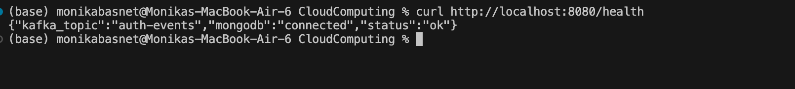

This demonstrates that the Processor API is available and MongoDB connectivity is healthy.

---

# 17. End-to-End Pipeline

The complete event flow is:

```text
Producer
   ↓
Kafka auth-events
   ↓
Processor
   ↓
MongoDB
```

The Producer successfully published an authentication event.

The Processor consumed and classified the event.

MongoDB stored the processed result.

## End-to-End Evidence

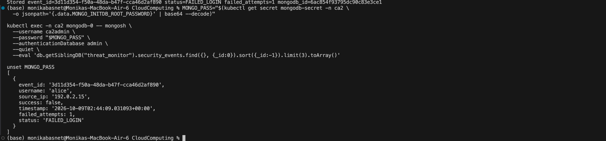

This validates the required logical pipeline:

```text
Producers → pub/sub hub → Processor → DB/Analytics
```

---

# 18. Brute-Force Detection

Repeated failed authentication events increase the failed-attempt counter.

Once suspicious activity is detected, the Processor classifies events as:

```text
POSSIBLE_BRUTE_FORCE
```

The Processor then stores those events in MongoDB.

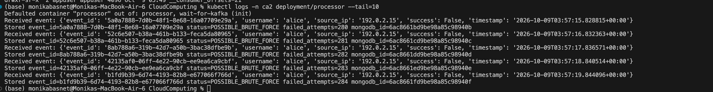

The logs demonstrate both classification and successful database persistence.

---

# 19. Network Isolation

Network security is implemented using Kubernetes NetworkPolicy.

Configuration:

[`network/network-policy.yaml`](network/network-policy.yaml)

## Kafka

Kafka allows TCP `9092` traffic from:

```text
Producer
Processor
```

## MongoDB

MongoDB allows TCP `27017` traffic from:

```text
Processor
```

Unauthorized Pods are not permitted to directly access these protected services through the defined ingress policies.

Amazon VPC CNI NetworkPolicy enforcement is enabled.

## Validation

An unauthorized test Pod attempted to connect to MongoDB and received:

```text
Connection timed out
```

The authorized Processor was then tested:

```text
Processor -> MongoDB: ALLOWED
```

## Evidence

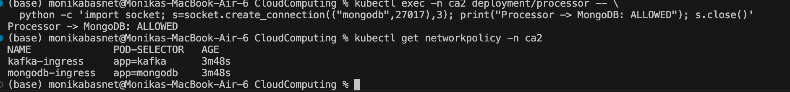

This demonstrates both:

```text
Unauthorized path → blocked
Authorized path   → allowed
```

---

# 20. RBAC and Least Privilege

Kubernetes RBAC is defined in:

[`rbac/processor-rbac.yaml`](rbac/processor-rbac.yaml)

The Processor uses:

```text
ServiceAccount: processor-sa
```

The associated Role provides limited access to ConfigMaps.

The ServiceAccount does not receive unnecessary destructive privileges.

## Allowed Test

```bash
kubectl auth can-i get configmaps \
  --as=system:serviceaccount:ca2:processor-sa \
  -n ca2
```

Result:

```text
yes
```

## Denied Test

```bash
kubectl auth can-i delete pods \
  --as=system:serviceaccount:ca2:processor-sa \
  -n ca2
```

Result:

```text
no
```

## Evidence

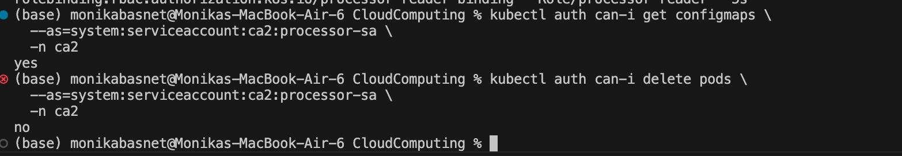

---

# 21. Observability

Kubernetes Metrics Server provides CPU and memory metrics.

Metrics were validated with:

```bash
kubectl top pods -n ca2
```

CPU and memory measurements were available for:

- Kafka
- MongoDB
- Processor
- Producer

These metrics are also consumed by the Horizontal Pod Autoscaler.

---

# 22. Horizontal Scaling Experiment

The Producer was tested using identical 30-second measurement windows.

## Baseline — One Producer

```text
31 events / 30 seconds
≈ 1.03 events/second
```

## Scaled — Three Producers

```text
98 events / 30 seconds
≈ 3.27 events/second
```

## Comparison

| Producer Replicas | Events / 30 sec | Events/sec |
|---:|---:|---:|
| 1 | 31 | 1.03 |
| 3 | 98 | 3.27 |

Observed improvement:

```text
≈ 3.16x
```

## Evidence

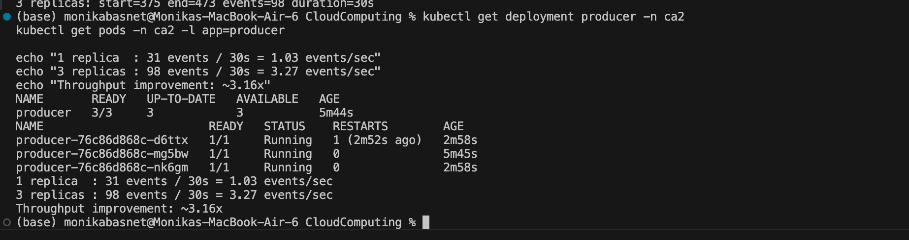

The experiment demonstrates increased event throughput when additional Producer replicas are deployed.

---

# 23. Horizontal Pod Autoscaler

The Producer HPA is defined in:

[`scaling/producer-hpa.yaml`](scaling/producer-hpa.yaml)

Configuration:

| Setting | Value |
|---|---:|
| Minimum replicas | 1 |
| Maximum replicas | 3 |
| CPU target | 50% |

During testing, Producer CPU utilization was approximately 4%.

After the Producer had previously been scaled to three replicas, HPA automatically reduced the Deployment back to one replica.

## Evidence

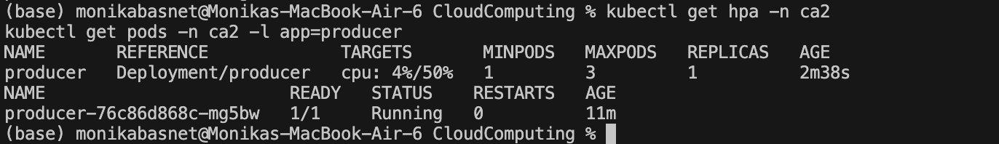

This demonstrates automatic CPU-based scale-down.

---

# 24. Complete Kubernetes Stack

The final Kubernetes environment contained:

```text
Kafka StatefulSet
MongoDB StatefulSet
Processor Deployment
Producer Deployment
Kafka Service
MongoDB Service
Processor Service
Kafka PVC
MongoDB PVC
ConfigMaps
Secrets
NetworkPolicies
RBAC
HorizontalPodAutoscaler
```

## Evidence

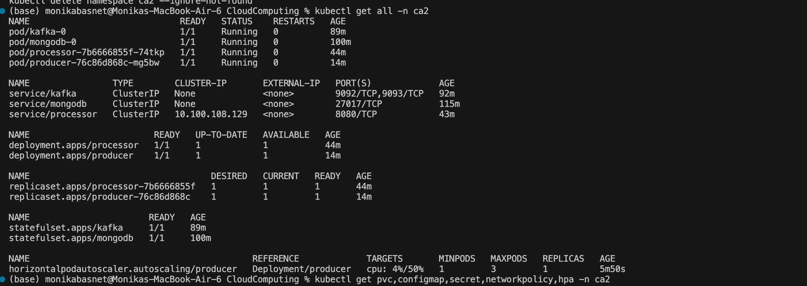

---

# 25. Automated Deployment

The project includes a Makefile for repeatable operation.

## Create EKS

```bash
make -C CA2 cluster-up
```

## Configure Cluster Platform

```bash
make -C CA2 cluster-setup
```

## Deploy Application

```bash
make -C CA2 deploy
```

The deployment process:

1. Creates the `ca2` namespace.
2. Prompts securely for the MongoDB password.
3. Creates Kubernetes Secrets.
4. Creates the StorageClass.
5. Deploys MongoDB.
6. Deploys Kafka.
7. Deploys the Processor.
8. Deploys the Producer.
9. Applies NetworkPolicies.
10. Applies RBAC.
11. Creates the Producer HPA.

## Check Status

```bash
make -C CA2 status
```

## Delete Application

```bash
make -C CA2 destroy
```

---

# 26. Fresh Environment Workflow

A new environment follows this order:

```text
1. Create EKS cluster
        ↓
2. Configure required EBS CSI Pod Identity prerequisite
        ↓
3. Configure cluster platform add-ons
        ↓
4. Deploy application
        ↓
5. Validate workloads
```

Commands:

```bash
make -C CA2 cluster-up
```

Complete the documented one-time EBS CSI Pod Identity prerequisite when required.

Then:

```bash
make -C CA2 cluster-setup
```

Then:

```bash
make -C CA2 deploy
```

The separation between cluster infrastructure, cluster-level IAM prerequisites, platform add-ons, and application resources is intentional.

---

# 27. Destroy and Redeploy Validation

Reproducibility was tested by deleting the complete CA2 application:

```bash
make -C CA2 destroy
```

The namespace was verified as absent.

The application was then recreated using:

```bash
make -C CA2 deploy
```

After deployment:

```text
Kafka       1/1 Running
MongoDB     1/1 Running
Processor   1/1 Running
Producer    1/1 Running

Kafka PVC   Bound
MongoDB PVC Bound
```

No manual Processor restart was required during the final validation.

## Automated Redeployment Evidence

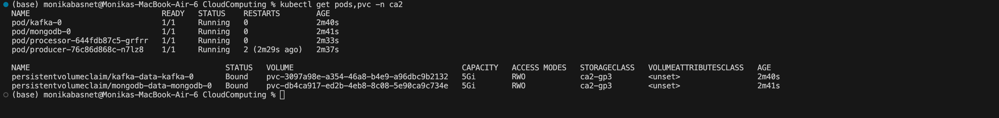

---

# 28. Post-Redeployment Pipeline Validation

After the automated redeployment, the Processor immediately resumed consuming authentication events and storing them in MongoDB.

Processor logs showed repeated:

```text
Received event
Stored event_id=...
```

## Evidence

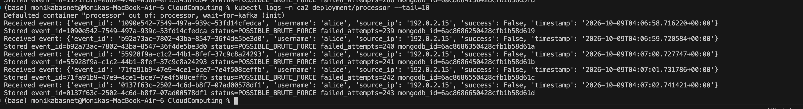

This demonstrates that the deployed application is not only recreated successfully but also returns to functional end-to-end operation.

---

# 29. IAM / Platform Setup Evidence

AWS IAM permissions were configured to support the EKS deployment and required AWS services.

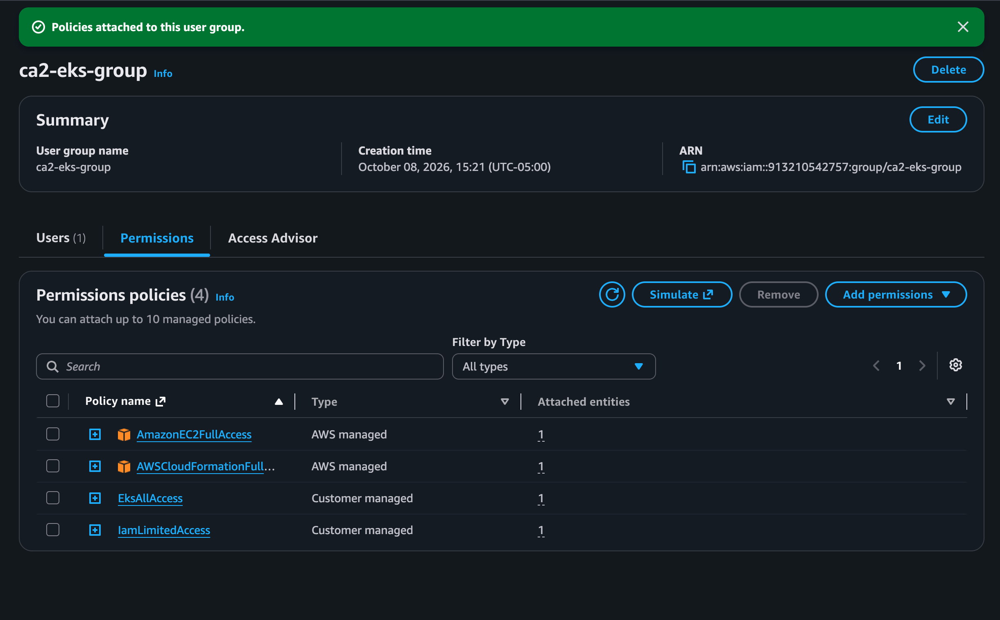

IAM role creation for the EBS CSI Pod Identity required elevated AWS permissions and is therefore documented as a cluster-level prerequisite.

No AWS credentials are committed to this repository.

---

# 30. Validation Commands

Useful validation commands include:

```bash
kubectl get nodes -o wide
```

```bash
kubectl get all -n ca2
```

```bash
kubectl get pods,pvc -n ca2
```

```bash
kubectl get networkpolicy -n ca2
```

```bash
kubectl get hpa -n ca2
```

```bash
kubectl top pods -n ca2
```

```bash
kubectl logs -n ca2 deployment/processor --tail=20
```

Check RBAC:

```bash
kubectl auth can-i get configmaps \
  --as=system:serviceaccount:ca2:processor-sa \
  -n ca2
```

Check Kafka topic:

```bash
kubectl exec -n ca2 kafka-0 -- \
  /opt/kafka/bin/kafka-topics.sh \
  --bootstrap-server localhost:9092 \
  --list
```

---

# 31. Security Controls

CA2 implements multiple security layers:

| Control | Implementation |
|---|---|
| Secret management | Kubernetes Secrets created at deployment |
| Git credential hygiene | Real passwords/keys excluded |
| Network isolation | Kubernetes NetworkPolicy |
| NetworkPolicy enforcement | Amazon VPC CNI |
| Authorization | Kubernetes RBAC |
| Workload identity | Dedicated Processor ServiceAccount |
| Persistent volume encryption | Encrypted gp3 EBS |
| AWS workload permissions | EKS Pod Identity |
| Private images | Amazon ECR |
| MongoDB authentication | Enabled |

---

# 32. Known Limitations

The current implementation has several deliberate limitations appropriate for the course environment:

1. Kafka uses one broker rather than a multi-broker production cluster.
2. MongoDB uses one replica rather than a MongoDB replica set.
3. The Processor REST API uses Flask's development server.
4. Scaling measurements use short 30-second experiments rather than long-duration benchmarks.
5. HPA automatic scale-down was demonstrated; a sustained CPU load test forcing automatic scale-up was not performed.
6. The Producer can restart during initial startup if Kafka is not yet available. The Processor explicitly handles Kafka startup using an init container.
7. Standard Kubernetes Secrets are used for runtime credential injection rather than an external production secrets-management platform.
8. EBS CSI Pod Identity role creation is a documented cluster-level IAM prerequisite because the restricted deployment identity does not have unrestricted IAM role creation privileges.

These limitations are also documented in the Integrity Packet.

---

# 33. Cleanup

Delete only the application:

```bash
make -C CA2 destroy
```

Delete the EKS cluster and worker infrastructure:

```bash
make -C CA2 cluster-down
```

Deleting only the `ca2` namespace does **not** delete the EKS cluster.

The cluster should be removed when it is no longer needed to avoid unnecessary AWS infrastructure charges.

---

# 34. Evidence Index

All evidence is stored under [`evidence/`](evidence/).

| # | Evidence | Demonstrates |
|---:|---|---|
| 01 | [IAM permissions](evidence/01-ca2-eks-iam-permissions.png) | AWS/EKS permission configuration |
| 02 | [Three EKS nodes](evidence/02-eks-three-nodes.png) | Platform execution |
| 03 | [MongoDB StatefulSet + PVC](evidence/03-mongodb-statefulset-pvc.png) | Stateful persistent storage |
| 04 | [Kafka + MongoDB PVCs](evidence/04-kafka-mongodb-statefulsets-pvcs.png) | Persistent stateful workloads |
| 05 | [Processor REST health](evidence/05-processor-rest-health.png) | REST API functionality |
| 06 | [End-to-end pipeline](evidence/06-end-to-end-pipeline.png) | Pipeline correctness |
| 07 | [NetworkPolicy enforcement](evidence/07-network-policy-enforcement.png) | Network isolation |
| 08 | [RBAC least privilege](evidence/08-rbac-least-privilege.png) | Kubernetes authorization |
| 09 | [Scaling throughput](evidence/09-producer-scaling-throughput.png) | Horizontal scaling measurement |
| 10 | [HPA autoscaling](evidence/10-hpa-autoscaling.png) | Automatic scaling |
| 11 | [Full Kubernetes stack](evidence/11-full-kubernetes-stack.png) | Complete orchestration |
| 12 | [Kafka persistent storage](evidence/12-kafka-persistent-storage.png) | Kafka actively using EBS |
| 13 | [Brute-force processing](evidence/13-brute-force-processing.png) | Security-event classification |
| 14 | [Automated redeployment](evidence/14-automated-redeployment.png) | Reproducibility |
| 15 | [Post-redeploy validation](evidence/15-post-redeploy-pipeline-validation.png) | Functional redeployment |

---

# 35. CA2 Rubric Coverage

## Declarative Completeness — 20%

Implemented through:

- EKS `cluster.yaml`
- Kubernetes namespace
- Deployments
- StatefulSets
- Services
- StorageClass
- PVC templates
- ConfigMaps
- NetworkPolicies
- RBAC
- HPA
- Makefile orchestration
- cluster platform setup script
- secure Secret creation script
- successful destroy/redeploy test

## Security and Isolation — 15%

Implemented through:

- Kubernetes Secrets
- encrypted EBS storage
- NetworkPolicies
- VPC CNI NetworkPolicy enforcement
- least-privilege RBAC
- dedicated ServiceAccount
- EKS Pod Identity
- private ECR repositories
- repository credential scan

## Scaling and Observability — 20%

Demonstrated through:

- Metrics Server
- `kubectl top`
- Producer CPU metrics
- HPA
- manual scaling from 1 → 3 replicas
- measured throughput:
  - 1 replica: 1.03 events/sec
  - 3 replicas: 3.27 events/sec
- approximately 3.16x observed throughput increase
- automatic HPA scale-down

## Documentation and Usability — 20%

Provided through:

- this README
- architecture diagrams
- clickable source links
- inline evidence
- deployment instructions
- validation commands
- cleanup instructions
- troubleshooting-informed configuration
- Integrity Packet

## Platform Execution — 10%

Demonstrated through:

- Amazon EKS
- three worker nodes
- Amazon ECR
- AWS EBS
- EBS CSI
- EKS Pod Identity
- VPC CNI
- running Kubernetes application
- successful REST request
- successful end-to-end event processing

## Integrity Packet — 15%

See:

[**CA2 Integrity Packet**](IntegrityPacket.md)

The packet documents:

- engineering/design claims
- evidence
- assumptions
- limitations
- validation/test results
- problems and revisions
- AI assistance and verification

---

# 36. Final Result

The final CA2 system successfully migrates the CA0/CA1 authentication-event pipeline to Kubernetes on Amazon EKS.

The final implementation demonstrates:

```text
Three-node Amazon EKS cluster        ✓
Producer Deployment                  ✓
Kafka StatefulSet                    ✓
Kafka KRaft mode                     ✓
MongoDB StatefulSet                  ✓
Processor Deployment                 ✓
REST API                             ✓
Amazon ECR images                    ✓
AWS EBS persistent storage           ✓
ConfigMaps                           ✓
Kubernetes Secrets                   ✓
NetworkPolicy enforcement            ✓
Least-privilege RBAC                 ✓
Metrics Server                       ✓
Horizontal scaling                   ✓
Measured throughput improvement      ✓
Horizontal Pod Autoscaler            ✓
Brute-force event classification     ✓
Automated deployment/destruction     ✓
Successful destroy/redeploy test     ✓
Post-redeploy pipeline validation    ✓
Integrity Packet                     ✓
```

The system preserves the required logical cloud pipeline:

```text
Producers → Pub/Sub Hub → Processor → Database/Analytics
```

while adding Kubernetes orchestration, persistence, security isolation, observability, scaling, and reproducible deployment.